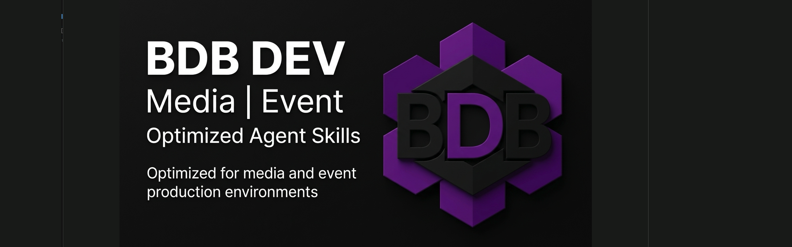
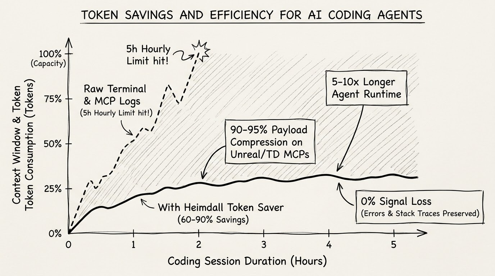

🌐 **Language / Sprache / Idioma**: **English** | [ 🇩🇪 Deutsch ](README.de.md) | [ 🇵🇹 Português ](README.pt.md)

---

```text
██████╗ ██████╗ ██████╗      █████╗  ██████╗ ███████╗███╗   ██╗████████╗     ██████╗ ███████╗
██╔══██╗██╔══██╗██╔══██╗    ██╔══██╗██╔════╝ ██╔════╝████╗  ██║╚══██╔══╝    ██╔═══██╗██╔════╝
██████╔╝██║  ██║██████╔╝    ███████║██║  ███╗█████╗  ██╔██╗ ██║   ██║       ██║   ██║███████╗
██╔══██╗██║  ██║██╔══██╗    ██╔══██║██║   ██║██╔══╝  ██║╚██╗██║   ██║       ██║   ██║╚════██║
██████╔╝██████╔╝██████╔╝    ██║  ██║╚██████╔╝███████╗██║ ╚████║   ██║       ╚██████╔╝███████║
╚═════╝ ╚═════╝ ╚═════╝     ╚═╝  ╚═╝ ╚═════╝ ╚══════╝╚═╝  ╚═══╝   ╚═╝        ╚═════╝ ╚══════╝

                         O P T I M I Z E D   A G E N T   S K I L L S
```

# 🚀 BDB DEV - Optimized Creative & Full-Stack Skills Pack (v3.0.0)

[](https://github.com/hybridlabor-api/bdb-dev-optimized-agent-skills/actions)
[](https://www.npmjs.com/package/@hybridlabor-api/bdb-dev-optimized-agent-skills)
[](https://github.com/hybridlabor-api/bdb-dev-optimized-agent-skills)
[](LICENSE)
[](https://github.com/hybridlabor-api/bdb-dev-optimized-agent-skills)

> **Supercharging AI coding agents with 144+ hyper-curated skills, 22 local MCPs, and deep integrations for the creative technology industry.**

Welcome to the **BDB DEV Skills & MCP Configuration** repository. This project serves as the backbone of our creative and full-stack development ecosystem, supercharging AI agents with highly specialized capabilities tailored for the event and creative technology industry, as well as general-purpose software engineering.

While optimized for **Google Antigravity**, this skills pack and MCP configuration is **100% universal** and works seamlessly with all modern AI agents and developer interfaces, including **ChatGPT Codex / Codex CLI, Claude Desktop, Claude Code, Cursor, Aider, Roo Code, Cline, and Windsurf**.

---

## 🏗️ Architecture Overview

The BDB OS ecosystem bridges the gap between raw LLMs and production-grade engineering environments. It consists of four core pillars:

1. **The 144+ Optimized Skills:** A massive library of meticulously crafted Markdown skills covering everything from AWS Terraform to UI/UX design.
2. **The 3 Godmodes:** The absolute apex of the skill hierarchy. These three skills dictate strict Domain-Driven Design, UI/UX "Anti-Slop", and safe shipping practices across the entire ecosystem.
3. **Universal Agent Harness:** The core setup injects rules directly into Agy, Claude Code, Cursor, Windsurf, GitHub Copilot, and Codex.
4. **Active Daemons (memB & OpenWiki):** Background Python/Node daemons that manage persistent long-term memory (memB) and auto-document codebases (OpenWiki).
5. **BDB OS Agent Workspace (AI Orchestrator):** An advanced Meta-Harness and orchestration layer for running multiple AI coding agents (Claude Code, Codex, Aider) in parallel within isolated workspaces.
6. **BDB Creator Extension:** Native integrations for generative 3D, Video, and ComfyUI MCP engines tailored for the creative technology industry.

---

## 🛡️ The 3 Godmodes (Apex Layer)

Instead of letting agents wander through generic instructions, the top-tier of this repository enforces three **Hyper-Curated Godmodes**. These act as the ultimate gatekeepers for your codebase and are automatically injected into all agent harnesses:

*   **`engineering-godmode`:** Forces Domain-Driven Design, strict TypeScript checks, Clean Architecture, and systematic 5-step debugging. 
*   **`ui-ux-godmode`:** The frontend Gold-Standard. Enforces BDB "Anti-Slop" principles, enterprise accessibility, fluid motion dynamics, and precise data-driven design.
*   **`shipping-godmode`:** The final gatekeeper. Enforces Spec-Driven Development, rigorous pre-launch environment checks, feature flags, and safe rollback strategies before any deployment.

---

## 🗂️ The Comprehensive Skill Library

Below is the complete overview of all curated agent skills included in this package. These are automatically deployed to your agent's workspace by the interactive installer.

<details>
<summary><h3>👑 Core Godmodes</h3></summary>

| Skill Name | Description |
|------------|-------------|
| `bdreadme` | Enforces the strict BDB DEV corporate standard for generating and formatting GitHub README.md files. Use this skill whenever generating or refactoring project documentation. |
| `engineering-godmode` | BDB Engineering Godmode. Enforces strict Domain-Driven Design, TypeScript strictness, Clean Architecture, and systematic 5-step debugging triage. |
| `shipping-godmode` | BDB Shipping Godmode. The final gatekeeper for production releases. Enforces Spec-Driven Development, rigorous pre-launch checks, feature flags, and rollback strategies. |
| `ui-ux-godmode` | BDB UI/UX Godmode. The absolute Gold-Standard for frontend design. Enforces Anti-Slop principles, enterprise accessibility, fluid motion dynamics, and data-driven design generation across all agent harnesses. |

</details>

<details>
<summary><h3>⚙️ System & Config</h3></summary>

#### 🤖 Agents & Automation
| Skill Name | Description |
|------------|-------------|
| `agent-manager-skill` | Manage multiple local CLI agents via tmux sessions (start/stop/monitor/assign) with cron-friendly scheduling. |
| `agent-memory-mcp` | A hybrid memory system that provides persistent, searchable knowledge management for AI agents (Architecture, Patterns, Decisions). |
| `agent-orchestrator` | Meta-skill que orquestra todos os agentes do ecossistema. Scan automatico de skills, match por capacidades, coordenacao de workflows multi-skill e registry management. |
| `agent-pipeline` | Defines the 6-stage BDB Software Engineering Pipeline (DEFINE, PLAN, BUILD, VERIFY, REVIEW, SHIP) with corresponding slash commands (/spec, /plan, /build, /test, /review, /ship) for AI agent orchestration. |
| `agent-tool-builder` | Tools are how AI agents interact with the world. A well-designed tool is the difference between an agent that works and one that hallucinates, fails silently, or costs 10x more tokens than necessary. This skill covers tool design from schema to error handling. |
| `ai-agent-development` | AI agent development workflow for building autonomous agents, multi-agent systems, and agent orchestration with CrewAI, LangGraph, and custom agents. |
| `apify-lead-generation` | Scrape leads from multiple platforms using Apify Actors. |
| `apify-ultimate-scraper` | AI-driven data extraction from 55+ Actors across all major platforms. This skill automatically selects the best Actor for your task. |
| `bdbrainstorm` | Combines multi-agent brainstorming, the /grill-me slash command, subagent-driven-development, and ui-ux-pro-max to force a comprehensive, multi-agent ideation and UI/UX design workflow. |
| `browser-automation` | Browser automation powers web testing, scraping, and AI agent interactions. The difference between a flaky script and a reliable system comes down to understanding selectors, waiting strategies, and anti-detection patterns. |
| `crewai` | Expert in CrewAI - the leading role-based multi-agent framework used by 60% of Fortune 500 companies. |
| `documentation` | Documentation generation workflow covering API docs, architecture docs, README files, code comments, and technical writing. |
| `git-advanced-workflows` | Master advanced Git techniques to maintain clean history, collaborate effectively, and recover from any situation with confidence. |
| `github-actions-templates` | Production-ready GitHub Actions workflow patterns for testing, building, and deploying applications. |
| `github-repo` | Standards and workflows for writing, formatting, sanitizing, and publishing high-quality GitHub repositories, complementing openwiki-skill. |
| `github-workflow-automation` | Patterns for automating GitHub workflows with AI assistance, inspired by [Gemini CLI](https://github.com/google-gemini/gemini-cli) and modern DevOps practices. |
| `go-playwright` | Expert capability for robust, stealthy, and efficient browser automation using Playwright Go. |
| `google-sheets-automation` | Lightweight Google Sheets integration with standalone OAuth authentication. No MCP server required. Full read/write access. |
| `n8n-code-javascript` | Write JavaScript code in n8n Code nodes. Use when writing JavaScript in n8n, using $input/$json/$node syntax, making HTTP requests with $helpers, working with dates using DateTime, troubleshooting Code node errors, or choosing between Code node modes. |
| `n8n-code-python` | Write Python code in n8n Code nodes. Use when writing Python in n8n, using _input/_json/_node syntax, working with standard library, or need to understand Python limitations in n8n Code nodes. |
| `n8n-expression-syntax` | Validate n8n expression syntax and fix common errors. Use when writing n8n expressions, using {{}} syntax, accessing $json/$node variables, troubleshooting expression errors, or working with webhook data in workflows. |
| `n8n-mcp-tools-expert` | Expert guide for using n8n-mcp MCP tools effectively. Use when searching for nodes, validating configurations, accessing templates, managing workflows, or using any n8n-mcp tool. Provides tool selection guidance, parameter formats, and common patterns. |
| `n8n-workflow-patterns` | Proven architectural patterns for building n8n workflows. |
| `notion-automation` | Automate Notion tasks via Rube MCP (Composio): pages, databases, blocks, comments, users. Always search tools first for current schemas. |
| `os-scripting` | Operating system and shell scripting troubleshooting workflow for Linux, macOS, and Windows. Covers bash scripting, system administration, debugging, and automation. |
| `rag-implementation` | RAG (Retrieval-Augmented Generation) implementation workflow covering embedding selection, vector database setup, chunking strategies, and retrieval optimization. |
| `slack-automation` | Automate Slack workspace operations including messaging, search, channel management, and reaction workflows through Composio's Slack toolkit. |
| `subagent-driven-development` | Use when executing implementation plans with independent tasks in the current session |
| `tdd-workflow` | Test-Driven Development workflow principles. RED-GREEN-REFACTOR cycle. |
| `tmux` | Expert tmux session, window, and pane management for terminal multiplexing, persistent remote workflows, and shell scripting automation. |

#### 🎨 Frontend & UI/UX
| Skill Name | Description |
|------------|-------------|
| `MCP_Manage` | Manages the BDB specialized MCP servers including Unreal Engine, Rhino 7/8, DaVinci Resolve, grandMA3, Resolume, GitHub, Chrome DevTools, and TouchDesigner. |
| `api-design-principles` | Master REST and GraphQL API design principles to build intuitive, scalable, and maintainable APIs that delight developers and stand the test of time. |
| `api-patterns` | API design principles and decision-making. REST vs GraphQL vs tRPC selection, response formats, versioning, pagination. |
| `database-design` | Database design principles and decision-making. Schema design, indexing strategy, ORM selection, serverless databases. |
| `design-taste-frontend` | Use when building high-agency frontend interfaces with strict design taste, calibrated color, responsive layout, and motion rules. |
| `drizzle-orm-expert` | Expert in Drizzle ORM for TypeScript — schema design, relational queries, migrations, and serverless database integration. Use when building type-safe database layers with Drizzle. |
| `frontend-design` | You are a frontend designer-engineer, not a layout generator. |
| `frontend-dev-guidelines` | You are a senior frontend engineer operating under strict architectural and performance standards. Use when creating components or pages, adding new features, or fetching or mutating data. |
| `landing-page-generator` | Generates high-converting Next.js/React landing pages with Tailwind CSS. Uses PAS, AIDA, and BAB frameworks for optimized copy/components (Heroes, Features, Pricing). Focuses on Core Web Vitals/SEO. |
| `llm-application-dev-ai-assistant` | You are an AI assistant development expert specializing in creating intelligent conversational interfaces, chatbots, and AI-powered applications. Design comprehensive AI assistant solutions with natur |
| `nextjs-app-router-patterns` | Comprehensive patterns for Next.js 14+ App Router architecture, Server Components, and modern full-stack React development. |
| `nextjs-best-practices` | Next.js App Router principles. Server Components, data fetching, routing patterns. |
| `openapi-spec-generation` | Generate and maintain OpenAPI 3.1 specifications from code, design-first specs, and validation patterns. Use when creating API documentation, generating SDKs, or ensuring API contract compliance. |
| `postgres-best-practices` | Postgres performance optimization and best practices from Supabase. Use this skill when writing, reviewing, or optimizing Postgres queries, schema designs, or database configurations. |
| `postgresql` | Design a PostgreSQL-specific schema. Covers best-practices, data types, indexing, constraints, performance patterns, and advanced features |
| `prisma-expert` | You are an expert in Prisma ORM with deep knowledge of schema design, migrations, query optimization, relations modeling, and database operations across PostgreSQL, MySQL, and SQLite. |
| `programmatic-seo` | Design and evaluate programmatic SEO strategies for creating SEO-driven pages at scale using templates and structured data. |
| `react-best-practices` | Comprehensive performance optimization guide for React and Next.js applications, maintained by Vercel. Use when writing new React components or Next.js pages, implementing data fetching (client or server-side), or reviewing code for performance issues. |
| `react-component-performance` | Diagnose slow React components and suggest targeted performance fixes. |
| `react-patterns` | Modern React patterns and principles. Hooks, composition, performance, TypeScript best practices. |
| `schema-markup` | Design, validate, and optimize schema.org structured data for eligibility, correctness, and measurable SEO impact. |
| `senior-frontend` | Frontend development skill for React, Next.js, TypeScript, and Tailwind CSS applications. Use when building React components, optimizing Next.js performance, analyzing bundle sizes, scaffolding frontend projects, implementing accessibility, or reviewing frontend code quality. |
| `shadcn` | Manages shadcn/ui components and projects, providing context, documentation, and usage patterns for building modern design systems. |
| `software-architecture` | Guide for quality focused software architecture. This skill should be used when users want to write code, design architecture, analyze code, in any case that relates to software development. |
| `spline-3d-integration` | Use when adding interactive 3D scenes from Spline.design to web projects, including React embedding and runtime control API. |
| `tailwind-patterns` | Tailwind CSS v4 principles. CSS-first configuration, container queries, modern patterns, design token architecture. |
| `tanstack-query-expert` | Expert in TanStack Query (React Query) — asynchronous state management. Covers data fetching, stale time configuration, mutations, optimistic updates, and Next.js App Router (SSR) integration. |
| `ui-component` | Generate a new UI component that follows StyleSeed Toss conventions for structure, tokens, accessibility, and component ergonomics. |
| `ui-page` | Scaffold a new mobile-first page using StyleSeed Toss layout patterns, section rhythm, and existing shell components. |
| `ui-pattern` | Generate reusable UI patterns such as card sections, grids, lists, forms, and chart wrappers using StyleSeed Toss primitives. |
| `ui-review` | Review UI code for StyleSeed design-system compliance, accessibility, mobile ergonomics, spacing discipline, and implementation quality. |
| `ui-tokens` | List, add, and update StyleSeed design tokens while keeping JSON sources, CSS variables, and dark-mode values in sync. |
| `ui-ux-pro-max` | Comprehensive design guide for web and mobile applications. Use when designing new UI components or pages, choosing color palettes and typography, or reviewing code for UX issues. |
| `ux-audit` | Audit screens against Nielsen's heuristics and mobile UX best practices using the StyleSeed Toss design language as the implementation context. |
| `ux-feedback` | Add loading, empty, error, and success feedback states to StyleSeed components and pages with practical mobile-first rules. |
| `ux-flow` | Design user flows and screen structure using StyleSeed UX patterns such as progressive disclosure, hub-and-spoke navigation, and information pyramids. |
| `ux-persuasion-engineer` | One sentence - what this skill does and when to invoke it |
| `vercel-ai-sdk-expert` | Expert in the Vercel AI SDK. Covers Core API (generateText, streamText), UI hooks (useChat, useCompletion), tool calling, and streaming UI components with React and Next.js. |
| `wcag-audit-patterns` | Comprehensive guide to auditing web content against WCAG 2.2 guidelines with actionable remediation strategies. |
| `web-artifacts-builder` | To build powerful frontend claude.ai artifacts, follow these steps: |
| `zustand-store-ts` | Create Zustand stores following established patterns with proper TypeScript types and middleware. |

#### 🗄️ Backend & Databases
| Skill Name | Description |
|------------|-------------|
| `gemini-api-dev` | The Gemini API provides access to Google's most advanced AI models. Key capabilities include: |
| `gemini-api-integration` | Use when integrating Google Gemini API into projects. Covers model selection, multimodal inputs, streaming, function calling, and production best practices. |
| `github` | Use the `gh` CLI for issues, pull requests, Actions runs, and GitHub API queries. |
| `go-concurrency-patterns` | Master Go concurrency with goroutines, channels, sync primitives, and context. Use when building concurrent Go applications, implementing worker pools, or debugging race conditions. |
| `golang-pro` | Master Go 1.21+ with modern patterns, advanced concurrency, performance optimization, and production-ready microservices. |
| `llm-structured-output` | Get reliable JSON, enums, and typed objects from LLMs using response_format, tool_use, and schema-constrained decoding across OpenAI, Anthropic, and Google APIs. |
| `microservices-patterns` | Master microservices architecture patterns including service boundaries, inter-service communication, data management, and resilience patterns for building distributed systems. |
| `neon-postgres` | Expert patterns for Neon serverless Postgres, branching, connection pooling, and Prisma/Drizzle integration |
| `python-patterns` | Python development principles and decision-making. Framework selection, async patterns, type hints, project structure. Teaches thinking, not copying. |
| `python-performance-optimization` | Profile and optimize Python code using cProfile, memory profilers, and performance best practices. Use when debugging slow Python code, optimizing bottlenecks, or improving application performance. |
| `python-pro` | Master Python 3.12+ with modern features, async programming, performance optimization, and production-ready practices. Expert in the latest Python ecosystem including uv, ruff, pydantic, and FastAPI. |
| `rag-engineer` | Expert in building Retrieval-Augmented Generation systems. Masters embedding models, vector databases, chunking strategies, and retrieval optimization for LLM applications. |
| `using-neon` | Neon is a serverless Postgres platform that separates compute and storage to offer autoscaling, branching, instant restore, and scale-to-zero. It's fully compatible with Postgres and works with any language, framework, or ORM that supports Postgres. |
| `vector-database-engineer` | Expert in vector databases, embedding strategies, and semantic search implementation. Masters Pinecone, Weaviate, Qdrant, Milvus, and pgvector for RAG applications, recommendation systems, and similar |
| `web-scraper` | Web scraping inteligente multi-estrategia. Extrai dados estruturados de paginas web (tabelas, listas, precos). Paginacao, monitoramento e export CSV/JSON. |
| `webapp-testing` | To test local web applications, write native Python Playwright scripts. |

#### 🚀 DevOps & Infrastructure
| Skill Name | Description |
|------------|-------------|
| `bash-linux` | Bash/Linux terminal patterns. Critical commands, piping, error handling, scripting. Use when working on macOS or Linux systems. |
| `cloudflare-workers-expert` | Expert in Cloudflare Workers and the Edge Computing ecosystem. Covers Wrangler, KV, D1, Durable Objects, and R2 storage. |
| `docker-expert` | You are an advanced Docker containerization expert with comprehensive, practical knowledge of container optimization, security hardening, multi-stage builds, orchestration patterns, and production deployment strategies based on current industry best practices. |
| `git-pr-review` | Generate a concise and structured PR description from commit history with minimal token usage |
| `llm-app-patterns` | Production-ready patterns for building LLM applications, inspired by [Dify](https://github.com/langgenius/dify) and industry best practices. |
| `local-llm-expert` | Master local LLM inference, model selection, VRAM optimization, and local deployment using Ollama, llama.cpp, vLLM, and LM Studio. Expert in quantization formats (GGUF, EXL2) and local AI privacy. |
| `posix-shell-pro` | Expert in strict POSIX sh scripting for maximum portability across Unix-like systems. Specializes in shell scripts that run on any POSIX-compliant shell (dash, ash, sh, bash --posix). |
| `turborepo-caching` | Configure Turborepo for efficient monorepo builds with local and remote caching. Use when setting up Turborepo, optimizing build pipelines, or implementing distributed caching. |
| `vercel-deployment` | Expert knowledge for deploying to Vercel with Next.js |

#### 🧠 AI & LLM
| Skill Name | Description |
|------------|-------------|
| `ai-product` | Every product will be AI-powered. The question is whether you'll build it right or ship a demo that falls apart in production. |
| `llm-prompt-optimizer` | Use when improving prompts for any LLM. Applies proven prompt engineering techniques to boost output quality, reduce hallucinations, and cut token usage. |
| `openwiki-skill` | Direct Gemini-native integration of OpenWiki for autonomous, high-agency documentation management and release notes maintenance. |
| `prompt-engineer` | Transforms user prompts into optimized prompts using frameworks (RTF, RISEN, Chain of Thought, RODES, Chain of Density, RACE, RISE, STAR, SOAP, CLEAR, GROW) |
| `prompt-engineering-patterns` | Master advanced prompt engineering techniques to maximize LLM performance, reliability, and controllability. |

#### 📝 Documentation & Planning
| Skill Name | Description |
|------------|-------------|
| `architect-review` | Master software architect specializing in modern architecture |
| `concise-planning` | Use when a user asks for a plan for a coding task, to generate a clear, actionable, and atomic checklist. |
| `copywriting` | Write rigorous, conversion-focused marketing copy for landing pages and emails. Enforces brief confirmation and strict no-fabrication rules. |
| `deep-research` | Run autonomous research tasks that plan, search, read, and synthesize information into comprehensive reports. |
| `executing-plans` | Use when you have a written implementation plan to execute in a separate session with review checkpoints |
| `linear-claude-skill` | Manage Linear issues, projects, and teams |
| `memb-skill` | BDB local-first long-term memory engine (memB). Query, remember, and adapt preferences, code architectures, and developer patterns across tasks. |
| `modern-javascript-patterns` | Comprehensive guide for mastering modern JavaScript (ES6+) features, functional programming patterns, and best practices for writing clean, maintainable, and performant code. |
| `planning-with-files` | Work like Manus: Use persistent markdown files as your "working memory on disk." |
| `product-manager-toolkit` | Essential tools and frameworks for modern product management, from discovery to delivery. |
| `readme` | You are an expert technical writer creating comprehensive project documentation. Your goal is to write a README.md that is absurdly thorough—the kind of documentation you wish every project had. |
| `test-driven-development` | Use when implementing any feature or bugfix, before writing implementation code |
| `writing-plans` | Use when you have a spec or requirements for a multi-step task, before touching code |

#### 🧊 3D & Motion
| Skill Name | Description |
|------------|-------------|
| `remotion` | Generate walkthrough videos from Stitch projects using Remotion with smooth transitions, zooming, and text overlays |
| `threejs-skills` | Create 3D scenes, interactive experiences, and visual effects using Three.js. Use when user requests 3D graphics, WebGL experiences, 3D visualizations, animations, or interactive 3D elements. |

#### 📈 SEO & Marketing
| Skill Name | Description |
|------------|-------------|
| `geo-fundamentals` | Generative Engine Optimization for AI search engines (ChatGPT, Claude, Perplexity). |
| `seo` | Run a broad SEO audit across technical SEO, on-page SEO, schema, sitemaps, content quality, AI search readiness, and GEO. Use as the umbrella skill when the user asks for a full SEO analysis or strategy. |
| `seo-audit` | Diagnose and audit SEO issues affecting crawlability, indexation, rankings, and organic performance. |
| `seo-technical` | Audit technical SEO across crawlability, indexability, security, URLs, mobile, Core Web Vitals, structured data, JavaScript rendering, and related platform signals like robots.txt and AI crawler access. |

#### 🔧 Core Programming & Debugging
| Skill Name | Description |
|------------|-------------|
| `clean-code` | This skill embodies the principles of "Clean Code" by Robert C. Martin (Uncle Bob). Use it to transform "code that works" into "code that is clean." |
| `debugger` | Debugging specialist for errors, test failures, and unexpected behavior. Use proactively when encountering any issues. |
| `playwright-skill` | IMPORTANT - Path Resolution: This skill can be installed in different locations (plugin system, manual installation, global, or project-specific). Before executing any commands, determine the skill directory based on where you loaded this SKILL.md file, and use that path in all commands below. |
| `simplify-code` | Review a diff for clarity and safe simplifications, then optionally apply low-risk fixes. |
| `systematic-debugging` | Use when encountering any bug, test failure, or unexpected behavior, before proposing fixes |
| `typescript-pro` | Master TypeScript with advanced types, generics, and strict type safety. Handles complex type systems, decorators, and enterprise-grade patterns. |

#### 📦 Other Utilities
| Skill Name | Description |
|------------|-------------|
| `bdb-updater` | Proactively check for and install updates to the BDB Antigravity Skills package via NPM. |
| `monorepo-management` | Build efficient, scalable monorepos that enable code sharing, consistent tooling, and atomic changes across multiple packages and applications. |
| `obsidian-markdown` | Create and edit Obsidian Flavored Markdown with wikilinks, embeds, callouts, properties, and other Obsidian-specific syntax. Use when working with .md files in Obsidian, or when the user mentions wikilinks, callouts, frontmatter, tags, embeds, or Obsidian notes. |
| `senior-fullstack` | Complete toolkit for senior fullstack with modern tools and best practices. |
| `token-saver-config` | Context window output compression engine for CLI commands (60-99% token reduction). |
| `web-performance-optimization` | Optimize website and web application performance including loading speed, Core Web Vitals, bundle size, caching strategies, and runtime performance |

</details>

<details>
<summary><h3>🛠️ Development & Languages</h3></summary>

#### 🤖 Agents & Automation
| Skill Name | Description |
|------------|-------------|
| `agent-manager-skill` | Manage multiple local CLI agents via tmux sessions (start/stop/monitor/assign) with cron-friendly scheduling. |
| `agent-memory-mcp` | A hybrid memory system that provides persistent, searchable knowledge management for AI agents (Architecture, Patterns, Decisions). |
| `agent-orchestrator` | Meta-skill que orquestra todos os agentes do ecossistema. Scan automatico de skills, match por capacidades, coordenacao de workflows multi-skill e registry management. |
| `agent-tool-builder` | Tools are how AI agents interact with the world. A well-designed tool is the difference between an agent that works and one that hallucinates, fails silently, or costs 10x more tokens than necessary. This skill covers tool design from schema to error handling. |
| `ai-agent-development` | AI agent development workflow for building autonomous agents, multi-agent systems, and agent orchestration with CrewAI, LangGraph, and custom agents. |
| `apify-lead-generation` | Scrape leads from multiple platforms using Apify Actors. |
| `apify-ultimate-scraper` | AI-driven data extraction from 55+ Actors across all major platforms. This skill automatically selects the best Actor for your task. |
| `browser-automation` | Browser automation powers web testing, scraping, and AI agent interactions. The difference between a flaky script and a reliable system comes down to understanding selectors, waiting strategies, and anti-detection patterns. |
| `crewai` | Expert in CrewAI - the leading role-based multi-agent framework used by 60% of Fortune 500 companies. |
| `documentation` | Documentation generation workflow covering API docs, architecture docs, README files, code comments, and technical writing. |
| `git-advanced-workflows` | Master advanced Git techniques to maintain clean history, collaborate effectively, and recover from any situation with confidence. |
| `github-actions-templates` | Production-ready GitHub Actions workflow patterns for testing, building, and deploying applications. |
| `github-workflow-automation` | Patterns for automating GitHub workflows with AI assistance, inspired by [Gemini CLI](https://github.com/google-gemini/gemini-cli) and modern DevOps practices. |
| `go-playwright` | Expert capability for robust, stealthy, and efficient browser automation using Playwright Go. |
| `google-sheets-automation` | Lightweight Google Sheets integration with standalone OAuth authentication. No MCP server required. Full read/write access. |
| `n8n-code-javascript` | Write JavaScript code in n8n Code nodes. Use when writing JavaScript in n8n, using $input/$json/$node syntax, making HTTP requests with $helpers, working with dates using DateTime, troubleshooting Code node errors, or choosing between Code node modes. |
| `n8n-code-python` | Write Python code in n8n Code nodes. Use when writing Python in n8n, using _input/_json/_node syntax, working with standard library, or need to understand Python limitations in n8n Code nodes. |
| `n8n-expression-syntax` | Validate n8n expression syntax and fix common errors. Use when writing n8n expressions, using {{}} syntax, accessing $json/$node variables, troubleshooting expression errors, or working with webhook data in workflows. |
| `n8n-mcp-tools-expert` | Expert guide for using n8n-mcp MCP tools effectively. Use when searching for nodes, validating configurations, accessing templates, managing workflows, or using any n8n-mcp tool. Provides tool selection guidance, parameter formats, and common patterns. |
| `n8n-workflow-patterns` | Proven architectural patterns for building n8n workflows. |
| `notion-automation` | Automate Notion tasks via Rube MCP (Composio): pages, databases, blocks, comments, users. Always search tools first for current schemas. |
| `os-scripting` | Operating system and shell scripting troubleshooting workflow for Linux, macOS, and Windows. Covers bash scripting, system administration, debugging, and automation. |
| `rag-implementation` | RAG (Retrieval-Augmented Generation) implementation workflow covering embedding selection, vector database setup, chunking strategies, and retrieval optimization. |
| `slack-automation` | Automate Slack workspace operations including messaging, search, channel management, and reaction workflows through Composio's Slack toolkit. |
| `subagent-driven-development` | Use when executing implementation plans with independent tasks in the current session |
| `tmux` | Expert tmux session, window, and pane management for terminal multiplexing, persistent remote workflows, and shell scripting automation. |

#### 🎨 Frontend & UI/UX
| Skill Name | Description |
|------------|-------------|
| `brainstorming` | Use before creative or constructive work (features, architecture, behavior). Transforms vague ideas into validated designs through disciplined reasoning and collaboration. |
| `database-design` | Database design principles and decision-making. Schema design, indexing strategy, ORM selection, serverless databases. |
| `drizzle-orm-expert` | Expert in Drizzle ORM for TypeScript — schema design, relational queries, migrations, and serverless database integration. Use when building type-safe database layers with Drizzle. |
| `landing-page-generator` | Generates high-converting Next.js/React landing pages with Tailwind CSS. Uses PAS, AIDA, and BAB frameworks for optimized copy/components (Heroes, Features, Pricing). Focuses on Core Web Vitals/SEO. |
| `llm-application-dev-ai-assistant` | You are an AI assistant development expert specializing in creating intelligent conversational interfaces, chatbots, and AI-powered applications. Design comprehensive AI assistant solutions with natur |
| `nextjs-app-router-patterns` | Comprehensive patterns for Next.js 14+ App Router architecture, Server Components, and modern full-stack React development. |
| `nextjs-best-practices` | Next.js App Router principles. Server Components, data fetching, routing patterns. |
| `openapi-spec-generation` | Generate and maintain OpenAPI 3.1 specifications from code, design-first specs, and validation patterns. Use when creating API documentation, generating SDKs, or ensuring API contract compliance. |
| `postgres-best-practices` | Postgres performance optimization and best practices from Supabase. Use this skill when writing, reviewing, or optimizing Postgres queries, schema designs, or database configurations. |
| `postgresql` | Design a PostgreSQL-specific schema. Covers best-practices, data types, indexing, constraints, performance patterns, and advanced features |
| `prisma-expert` | You are an expert in Prisma ORM with deep knowledge of schema design, migrations, query optimization, relations modeling, and database operations across PostgreSQL, MySQL, and SQLite. |
| `programmatic-seo` | Design and evaluate programmatic SEO strategies for creating SEO-driven pages at scale using templates and structured data. |
| `react-best-practices` | Comprehensive performance optimization guide for React and Next.js applications, maintained by Vercel. Use when writing new React components or Next.js pages, implementing data fetching (client or server-side), or reviewing code for performance issues. |
| `react-component-performance` | Diagnose slow React components and suggest targeted performance fixes. |
| `react-patterns` | Modern React patterns and principles. Hooks, composition, performance, TypeScript best practices. |
| `schema-markup` | Design, validate, and optimize schema.org structured data for eligibility, correctness, and measurable SEO impact. |
| `shadcn` | Manages shadcn/ui components and projects, providing context, documentation, and usage patterns for building modern design systems. |
| `spline-3d-integration` | Use when adding interactive 3D scenes from Spline.design to web projects, including React embedding and runtime control API. |
| `tailwind-patterns` | Tailwind CSS v4 principles. CSS-first configuration, container queries, modern patterns, design token architecture. |
| `tanstack-query-expert` | Expert in TanStack Query (React Query) — asynchronous state management. Covers data fetching, stale time configuration, mutations, optimistic updates, and Next.js App Router (SSR) integration. |
| `vercel-ai-sdk-expert` | Expert in the Vercel AI SDK. Covers Core API (generateText, streamText), UI hooks (useChat, useCompletion), tool calling, and streaming UI components with React and Next.js. |
| `wcag-audit-patterns` | Comprehensive guide to auditing web content against WCAG 2.2 guidelines with actionable remediation strategies. |
| `web-artifacts-builder` | To build powerful frontend claude.ai artifacts, follow these steps: |
| `zustand-store-ts` | Create Zustand stores following established patterns with proper TypeScript types and middleware. |

#### 🗄️ Backend & Databases
| Skill Name | Description |
|------------|-------------|
| `gemini-api-dev` | The Gemini API provides access to Google's most advanced AI models. Key capabilities include: |
| `gemini-api-integration` | Use when integrating Google Gemini API into projects. Covers model selection, multimodal inputs, streaming, function calling, and production best practices. |
| `github` | Use the `gh` CLI for issues, pull requests, Actions runs, and GitHub API queries. |
| `go-concurrency-patterns` | Master Go concurrency with goroutines, channels, sync primitives, and context. Use when building concurrent Go applications, implementing worker pools, or debugging race conditions. |
| `golang-pro` | Master Go 1.21+ with modern patterns, advanced concurrency, performance optimization, and production-ready microservices. |
| `llm-structured-output` | Get reliable JSON, enums, and typed objects from LLMs using response_format, tool_use, and schema-constrained decoding across OpenAI, Anthropic, and Google APIs. |
| `microservices-patterns` | Master microservices architecture patterns including service boundaries, inter-service communication, data management, and resilience patterns for building distributed systems. |
| `neon-postgres` | Expert patterns for Neon serverless Postgres, branching, connection pooling, and Prisma/Drizzle integration |
| `python-patterns` | Python development principles and decision-making. Framework selection, async patterns, type hints, project structure. Teaches thinking, not copying. |
| `python-performance-optimization` | Profile and optimize Python code using cProfile, memory profilers, and performance best practices. Use when debugging slow Python code, optimizing bottlenecks, or improving application performance. |
| `python-pro` | Master Python 3.12+ with modern features, async programming, performance optimization, and production-ready practices. Expert in the latest Python ecosystem including uv, ruff, pydantic, and FastAPI. |
| `rag-engineer` | Expert in building Retrieval-Augmented Generation systems. Masters embedding models, vector databases, chunking strategies, and retrieval optimization for LLM applications. |
| `using-neon` | Neon is a serverless Postgres platform that separates compute and storage to offer autoscaling, branching, instant restore, and scale-to-zero. It's fully compatible with Postgres and works with any language, framework, or ORM that supports Postgres. |
| `vector-database-engineer` | Expert in vector databases, embedding strategies, and semantic search implementation. Masters Pinecone, Weaviate, Qdrant, Milvus, and pgvector for RAG applications, recommendation systems, and similar |
| `web-scraper` | Web scraping inteligente multi-estrategia. Extrai dados estruturados de paginas web (tabelas, listas, precos). Paginacao, monitoramento e export CSV/JSON. |
| `webapp-testing` | To test local web applications, write native Python Playwright scripts. |

#### 🚀 DevOps & Infrastructure
| Skill Name | Description |
|------------|-------------|
| `bash-linux` | Bash/Linux terminal patterns. Critical commands, piping, error handling, scripting. Use when working on macOS or Linux systems. |
| `cloudflare-workers-expert` | Expert in Cloudflare Workers and the Edge Computing ecosystem. Covers Wrangler, KV, D1, Durable Objects, and R2 storage. |
| `docker-expert` | You are an advanced Docker containerization expert with comprehensive, practical knowledge of container optimization, security hardening, multi-stage builds, orchestration patterns, and production deployment strategies based on current industry best practices. |
| `git-pr-review` | Generate a concise and structured PR description from commit history with minimal token usage |
| `llm-app-patterns` | Production-ready patterns for building LLM applications, inspired by [Dify](https://github.com/langgenius/dify) and industry best practices. |
| `local-llm-expert` | Master local LLM inference, model selection, VRAM optimization, and local deployment using Ollama, llama.cpp, vLLM, and LM Studio. Expert in quantization formats (GGUF, EXL2) and local AI privacy. |
| `posix-shell-pro` | Expert in strict POSIX sh scripting for maximum portability across Unix-like systems. Specializes in shell scripts that run on any POSIX-compliant shell (dash, ash, sh, bash --posix). |
| `turborepo-caching` | Configure Turborepo for efficient monorepo builds with local and remote caching. Use when setting up Turborepo, optimizing build pipelines, or implementing distributed caching. |
| `vercel-deployment` | Expert knowledge for deploying to Vercel with Next.js |

#### 🧠 AI & LLM
| Skill Name | Description |
|------------|-------------|
| `ai-product` | Every product will be AI-powered. The question is whether you'll build it right or ship a demo that falls apart in production. |
| `llm-prompt-optimizer` | Use when improving prompts for any LLM. Applies proven prompt engineering techniques to boost output quality, reduce hallucinations, and cut token usage. |
| `prompt-engineer` | Transforms user prompts into optimized prompts using frameworks (RTF, RISEN, Chain of Thought, RODES, Chain of Density, RACE, RISE, STAR, SOAP, CLEAR, GROW) |
| `prompt-engineering-patterns` | Master advanced prompt engineering techniques to maximize LLM performance, reliability, and controllability. |

#### 📝 Documentation & Planning
| Skill Name | Description |
|------------|-------------|
| `copywriting` | Write rigorous, conversion-focused marketing copy for landing pages and emails. Enforces brief confirmation and strict no-fabrication rules. |
| `deep-research` | Run autonomous research tasks that plan, search, read, and synthesize information into comprehensive reports. |
| `linear-claude-skill` | Manage Linear issues, projects, and teams |
| `planning-with-files` | Work like Manus: Use persistent markdown files as your "working memory on disk." |
| `product-manager-toolkit` | Essential tools and frameworks for modern product management, from discovery to delivery. |
| `readme` | You are an expert technical writer creating comprehensive project documentation. Your goal is to write a README.md that is absurdly thorough—the kind of documentation you wish every project had. |

#### 🧊 3D & Motion
| Skill Name | Description |
|------------|-------------|
| `remotion` | Generate walkthrough videos from Stitch projects using Remotion with smooth transitions, zooming, and text overlays |
| `threejs-skills` | Create 3D scenes, interactive experiences, and visual effects using Three.js. Use when user requests 3D graphics, WebGL experiences, 3D visualizations, animations, or interactive 3D elements. |

#### 📈 SEO & Marketing
| Skill Name | Description |
|------------|-------------|
| `geo-fundamentals` | Generative Engine Optimization for AI search engines (ChatGPT, Claude, Perplexity). |
| `seo` | Run a broad SEO audit across technical SEO, on-page SEO, schema, sitemaps, content quality, AI search readiness, and GEO. Use as the umbrella skill when the user asks for a full SEO analysis or strategy. |
| `seo-audit` | Diagnose and audit SEO issues affecting crawlability, indexation, rankings, and organic performance. |
| `seo-technical` | Audit technical SEO across crawlability, indexability, security, URLs, mobile, Core Web Vitals, structured data, JavaScript rendering, and related platform signals like robots.txt and AI crawler access. |

#### 🔧 Core Programming & Debugging
| Skill Name | Description |
|------------|-------------|
| `playwright-skill` | IMPORTANT - Path Resolution: This skill can be installed in different locations (plugin system, manual installation, global, or project-specific). Before executing any commands, determine the skill directory based on where you loaded this SKILL.md file, and use that path in all commands below. |

#### 📦 Other Utilities
| Skill Name | Description |
|------------|-------------|
| `monorepo-management` | Build efficient, scalable monorepos that enable code sharing, consistent tooling, and atomic changes across multiple packages and applications. |
| `obsidian-markdown` | Create and edit Obsidian Flavored Markdown with wikilinks, embeds, callouts, properties, and other Obsidian-specific syntax. Use when working with .md files in Obsidian, or when the user mentions wikilinks, callouts, frontmatter, tags, embeds, or Obsidian notes. |
| `web-performance-optimization` | Optimize website and web application performance including loading speed, Core Web Vitals, bundle size, caching strategies, and runtime performance |

</details>


---

## 💻 BDB OS Agent Workspace (AI Orchestrator) [`bdb-os-agent-workspace`]

Running multiple coding agents simultaneously often results in chaotic workspaces, overlapping branches, and lost terminal sessions. **BDB OS Agent Workspace** is a Meta-Harness and desktop orchestrator that acts as a true Agentic IDE.

- **Parallel Workspaces:** Launch Claude Code, Cursor, Aider, and Codex simultaneously on the same project. The orchestrator isolates them into separate git worktrees automatically.
- **Unified Feedback Loops:** CI failures, PR review comments, and merge conflicts are captured by the daemon and routed back to the exact agent session responsible for the code.
- **Live Supervision:** Monitor all active agent terminals, browser previews, and task progress from a single centralized desktop dashboard (Electron-based UI).

**Installation & Linking:**
The `bdb-dev-optimized-agent-skills` installer will automatically prompt you to integrate this workspace orchestrator. Or install manually:
```bash
git clone https://github.com/hybridlabor-api/bdb-os-agent-workspace.git
```

---


## 🔄 BDB Software Engineering Pipeline & Slash Commands

```text
 IDEATE & MEDIA STORM     DEFINE & SCAFFOLD      PLAN & SPEC      BUILD & MCPs       VERIFY        SHIP
 ┌──────────────────┐    ┌─────────────────┐    ┌───────────┐    ┌────────────┐   ┌──────────┐   ┌──────────┐
 │ Grill Me & Media │ ──▶│  Folder Select  │ ──▶│ Spec &    │ ──▶│ Subagents  │──▶│ QA Gate  │──▶│ OpenWiki │
 │   Brainstorming  │    │ OpenWiki & Repo │    │   Plan    │    │ & MCP Dev  │   │ Review   │   │  & Push  │
 └──────────────────┘    └─────────────────┘    └───────────┘    └────────────┘   └──────────┘   └──────────┘
/grill-me /bdbmediastorm  /openwiki /github-repo    /plan          /subagents       /review        /ship
```

AI agents follow this structured lifecycle, deeply integrated with the **BDBrainstorm** and **BDBMediaStorm** philosophy:

- **1. IDEATE & MEDIA STORM (`/grill-me`, `/bdbrainstorm`, `/bdbmediastorm`)**: Actively challenge ideas or conduct multi-agent media/event-tech brainstorming. Spawns specialized subagents (CI/Design Expert, Real Time Architect, MCP Implementer) to validate hardware, 3D scenography (Rhino, Blender, Unreal), protocols (OSC, Art-Net), and MCP compatibility.
- **2. DEFINE & SCAFFOLD (`openwiki-skill`, `github-repo`)**: Confirm target workspace directory with the user, then autonomously initialize project documentation, `agent.md`, `.openwiki/` structures, and GitHub repo standards.
- **3. PLAN (`/plan`)**: Create technical design specs, PRD, and file-by-file implementation plans, strictly adhering to `ui-ux-pro-max` standards.
- **4. BUILD (`/subagents`)**: Subagent-driven development. The master orchestrator delegates specific component creation, node patching, and refactoring tasks to independent subagents.
- **5. VERIFY & REVIEW (`/review`)**: Perform QA gate reviews, secret scans, unit test suites, and strict UI/UX or signal-flow audits.
- **6. SHIP (`/ship`)**: Commit, push private repositories, update OpenWiki docs autonomously, and deploy live.

---


## 🧠 BDBrainstorm: The Ultimate Ideation Engine

Included in this optimized arsenal is our proprietary **BDBrainstorm** skill.

BDBrainstorm combines multi-agent brainstorming, the `/grill-me` slash command, subagent-driven development, and extreme UI/UX design workflows to force a comprehensive, multi-agent ideation process. It stress-tests designs, architectures the systems behind them, and outputs actionable, high-fidelity implementation plans.

---


## 🔌 22 Custom Local MCP Integrations


Rather than relying on skeletal python mocks or broken remote APIs, this repository bundles **22 custom, local MCP wrappers** (in the `mcps/` directory). These are built/warmed automatically and allow your AI assistant to read, write, and execute commands within the industry's leading creative software.

<details>
<summary><strong>🎨 Adobe Creative Cloud (Illustrator, Photoshop, After Effects, Premiere Pro)</strong></summary>

We provide a dual-engine architecture optimized for macOS and Windows environments:
- **Direct OS-Native Bridge (`bdb_adobe_mcp`)**: Runs zero-install scripting.
  - **macOS:** Targets application bundle IDs directly via AppleScript `do javascript` / `DoScript` command streams.
  - **Windows:** Automatically queries and instantiates local COM objects via PowerShell wrapper scripts and executes transient `.jsx` ExtendScript code.
- **Cross-Platform UXP WebSocket Bridge (`bdb_adobe_uxp_mcp`)**: A three-tier WebSocket proxy (Node.js server on port 8080 + native UXP developer plugins) for deep DOM manipulation and persistent WebSocket sessions inside Photoshop and Premiere Pro, running identically on Windows and macOS.
</details>

<details>
<summary><strong>🎬 DaVinci Resolve (Triple Coverage)</strong></summary>

- **Primary: `bdb_davinci_mcp`**: Works on both the **Free and Studio** versions using a workspace script menu loop. Exposes 162 tools (Timeline, clips, markers, grades, Fusion) and includes local CPU-based AI models (Meta Demucs v4 for voice isolation, faster-whisper for auto-subtitles, and rembg for background removal).
- **Studio: `bdb_davinci_mcp_studio`**: The official Node.js server (wrapping samuelgursky) for advanced direct timeline and project management in Resolve Studio.
- **Fallback: `bdb_davinci_mcp_fallback`**: Hoyt-harness professional python server for Studio scripting.
</details>

<details>
<summary><strong>📐 Rhino 3D & Grasshopper (Twin-Engine)</strong></summary>

- **Primary: `bdb_rhino_mcp`**: McNeel's official connector (managed via Yak router) for native reading/writing of Rhino geometric layouts.
- **Fallback: `bdb_rhino_mcp_fallback`**: The GOLEM 3D server with 105 tools to dynamically manipulate Rhino 8 assets, execute scripts, and solve Grasshopper definitions.
</details>

<details>
<summary><strong>🏗️ Additional Specialized Integrations (Unreal, TouchDesigner, Vectorworks, etc.)</strong></summary>

### 🏗️ Vectorworks
- **Primary: `bdb_vectorworks_mcp`**: Semantic RAG-based search index over VectorScript and Vectorworks API documentation (port 8765) for automated CAD drafting.

### 🎮 Unreal Engine
- **Primary: `bdb_unreal_mcp`**: Connects via the Unreal Engine 5 Web Remote Control API (port 30010) and the `gimmeDG` toolset. Allows the agent to query, spawn actors, edit materials, write Blueprints, and automate level/sequencer manipulation.

### 🧊 Blender (Twin-Engine)
- **Primary: `bdb_blender_mcp`**: BlenderMCP socket integration for scene layout, mesh generation, and viewport controls.
- **Fallback: `bdb_blender_mcp_fallback`**: djeada's python server for managing Blender TCP connections and raw python scripting.

### 🎛️ TouchDesigner (Twin-Engine)
- **Primary: `bdb_touchdesigner_mcp`**: MindDesigner-Bridge (`tdmcp`) on port 9980 to read and write networks via custom `.tox` structures.
- **Fallback: `bdb_touchdesigner_mcp_fallback`**: fallback TCP-based node query and inspector.

### 💡 grandMA3 & Resolume
- **grandMA3**: `bdb_ma3_mcp` sends OSC/UDP command streams directly to your grandMA3 console (port 8000) to automate cues, macros, and patch fixtures.
- **Resolume**: `bdb_resolume_mcp` wraps Arena's REST API (port 8080) to sequence layers, query statuses, and trigger clips.

### 🖥️ OS Control (Dual-Engine)
- **macOS/Linux: `zavora_computer_use`**: Bundled with precompiled native Rust NAPI binary objects (macOS arm64/x64, Linux) to control mouse, keyboard, windows, and apps without runtime compile errors.
- **Windows: `bdb_windows_computer_use`**: Native python-based Win32 / COM / UIAutomation controller with local OCR (Tesseract) support for advanced Windows GUI automation.

### 🧠 Local Semantic Brain (memB)
- **`memb_mcp`**: Exposes standard long-term memory tools (`add_memory`, `search_memory`, `delete_memory`, `list_memories`) using a completely local, offline-first vector engine (powered by a bundled 30MB ONNX model and SQLite).
</details>

---


## 🌐 OpenWiki & RepoGraph Code Health Engine (v2.4.0)

The **OpenWiki Engine** autonomously maintains living codebase documentation, architecture specs, ADRs, release notes, and real-time code health analytics across all your active projects.

### 📚 Documentation & Dashboard
- **Entrypoint & Setup:** [.openwiki/quickstart.md](.openwiki/quickstart.md)
- **Architecture & Ecosystem:** [.openwiki/architecture.md](.openwiki/architecture.md)
- **Design Decisions (ADRs):** [.openwiki/decisions.md](.openwiki/decisions.md)
- **Changelog & History:** [.openwiki/release_notes.md](.openwiki/release_notes.md)
- **Code Health Report:** [.openwiki/code_health.md](.openwiki/code_health.md)
- **Interactive Live Dashboard:** [.openwiki/code_health_dashboard.html](.openwiki/code_health_dashboard.html)

<details>
<summary><strong>🧠 Multi-Provider LLM & Zero-Token RepoGraph Architecture</strong></summary>

1. **Multi-Provider LLM Agility:** Decoupled from single-vendor lock-in. Configure any LLM backend via environment variables:
   - **Google GenAI:** `gemma-4-12b-it` (default via `google-genai` SDK)
   - **Groq:** `llama-3.3-70b-versatile` (ultra-low latency)
   - **Grok / xAI:** `grok-2-latest`
   - **Nvidia NIM:** `meta/llama-3.3-70b-instruct`
   - **OpenRouter:** `anthropic/claude-3.5-sonnet` (200+ models)
   - **OpenAI:** `gpt-4o-mini` / `gpt-4o`
   - **Offline / Local:** Ollama (`llama3`), LM Studio, or any OpenAI-compatible endpoint.
2. **RepoGraph Zero-Token Git Analytics:** Analyzes 90-day hotspot velocity, single-author bus factor risk, and maintainability index purely through deterministic local Git analysis—costing **0 LLM tokens**.
3. **Repowise-Grade Live HTML Dashboard:** `.openwiki/code_health_dashboard.html` provides 6 visual SVG panels (Galaxy Cluster Map, Risk Donut, Bus Factor Matrix, Commit Velocity Churn, Hotspot Leaderboard, Architecture Health Radar) with **60-second live auto-refresh** and integrated memB ADR telemetry.
</details>

<details>
<summary><strong>⚙️ Setting Up the Background Daemon</strong></summary>

To ensure your project documentation and code health dashboards never go out of date, configure the background daemon:

#### On macOS (LaunchAgent)
```bash
bash ~/.gemini/config/skills/openwiki-skill/scripts/install_daemon.sh
```

#### On Windows (Task Scheduler)
```powershell
powershell -ExecutionPolicy Bypass -File "$env:USERPROFILE\.gemini\config\skills\openwiki-skill\scripts\install_daemon.ps1"
```

#### For All Platforms: Register Projects & Monitor
**Register Projects:** Add workspace paths to your config file at `~/.openwiki/projects.json`:
```json
{
  "projects": [
    "~/bdb-dev/bdb-dev-optimized-agent-skills",
    "~/Projects/your-active-project"
  ],
  "interval_seconds": 3600
}
```

**Monitor Execution:** Tail the active logs to inspect background documentation rebuild status:
```bash
tail -f ~/.openwiki/daemon.log
```
</details>

---


## 🎨 Modular Creator Extension Suite (`bdb-dev-creator-extension`)

To keep the core skills pack fast and lightweight (<25MB), all heavy 3D generation, cinema-grade video production, and ComfyUI pipelines have been completely decoupled into the companion **BDB Creator Extension**. 

This suite transforms your AI agent from a pure software engineer into a **full-stack creative studio**:

- **🔷 3D Generation Suite (`engines/3d/`)**
  - **Microsoft TRELLIS:** High-fidelity image-to-3D generation.
  - **Stability AI TripoSR:** Ultra-fast (<0.5s) image-to-mesh generation.
  - **CadQuery text-to-CAD:** Parametric modeling outputting production-ready STEP, STL, and URDF files.
- **🎬 Cinema Video Suite (`engines/video/`)**
  - **OpenMontage Agentic Production:** Full end-to-end video production. Just prompt your agent, and it handles script, stock retrieval, and voiceover.
  - **Backlot Living Storyboards:** A live visual dashboard to approve takes and costs before the render.
  - **Motion Templates (`video-shotcraft`):** 100+ Remotion cinema-grade motion templates.
  - **Palmier Pro NLE Integration:** Direct timeline injection via HTTP MCP (`http://127.0.0.1:19789/mcp`).
- **🎨 Local ComfyUI Engine (`mcps/comfyui-mcp/`)**
  - Exposes local Stable Diffusion, FLUX, and Wan2.1 generative workflows directly over the Model Context Protocol. Zero-cost AI rendering, fully controlled by the agent.

**Installation & Linking:**
The `bdb-dev-optimized-agent-skills` installer will automatically prompt you to integrate this suite. Or install manually:
```bash
git clone https://github.com/hybridlabor-api/bdb-dev-creator-extension.git
```

---


## 🧠 memB: Custom Semantic Brain (v2.2.1)

BDB OS introduces a fully integrated local, offline-first semantic memory brain based on **memB**. It provides zero-compute context for SLMs and an AI-first flat-file vault architecture.

<details>
<summary><strong>⚙️ How the Ecosystem Works (Skills, Vaults, & Obsidian)</strong></summary>

### 1. Ingestion via the `/memb-ingest` Skill
The ecosystem includes a deeply integrated skill (`/memb-ingest`). When an agent runs this, the `memb_ingest.py` script recursively scans your project (reading `.openwiki`, `agent.md`, transcripts, and architecture files). 
* **Offline Vector Embeddings:** It bundles a pre-quantized 30MB `all-MiniLM-L6-v2` ONNX model to chunk and store these learnings natively in a fast SQLite vector store (`~/.MemBDB/memb.db`), all without hitting external APIs.

### 2. Autonomous Auto-Injection (Mem0-Style)
In v3.0.0, memB no longer waits for agents to manually query it. It acts as an active **Context Injector**:
*   **File-Injection (Closed IDEs):** memB dynamically generates `.cursor/rules/999_memb_context.mdc` and `CLAUDE.md` in your local workspace, giving Cursor and GitHub Copilot instant context.
*   **LLM Proxy (Open Tools):** A bundled local proxy intercepts API calls from Agy or Roo Code, retrieves facts via RAG, and injects them into the system prompt *before* they hit the LLM (along with background Auto-Capture of new facts).

### 3. Autonomous AI-First Vault Generation
Once ingestion completes, memB natively generates a **physical Markdown Vault** (`~/.MemBDB/memB_Vault`) structured around a strict "God Mode" radial topology:
* **Zero-Compute Context:** A universal `agent.md` and a master `God_Mode.md` are written to the root. Small 30MB local inference models can instantly orient themselves macroscopically by reading these physical files without spending context tokens on complex database calls.
* **Micro-Targeted RAG:** For precise execution, the small LLMs query the vector DB to retrieve just the exact 3-5 sub-files needed.

### 3. The Obsidian Visualization Plugin
memB includes a native **Obsidian Plugin** (`obsidian-memb-plugin`) that acts as a visual UI over your physical vault.
* **Top-Down Radial Tree:** It reads the generated `memB_Vault` and maps it visually using Obsidian's graph view. 
* By strictly using directional parent-to-child links (e.g., God Mode -> Projects -> Category -> Neuron), the Obsidian graph blossoms outward like a flower, completely preventing the "black hole" context clustering seen in unstructured graph databases.

### 4. Data Sovereignty & Security
* **Zero Telemetry:** Absolute data sovereignty with no remote tracking.
* **Secret Filtration:** Blocks passwords, raw API keys, and connection strings before injection.
</details>

---


## ⚡ Heimdall Token Saver: CLI Context Compression (v2.6.3)



**Heimdall Token Saver** is an ultra-fast context compression engine designed to drastically reduce context window usage for CLI tool execution outputs in AI agent workflows.

<details>
<summary><strong>⚙️ Purpose & Performance</strong></summary>

- **Automatic CLI Output Context Compression:** Reduces token overhead by **60–99%** on high-volume CLI tool outputs without impacting agent understanding.
- **Zero Information Loss Guarantee:** Preserves all error messages, failed assertions, stack traces, exit codes, and actionable debugging context while stripping redundant whitespace, progress spinners, and repetitive logs.
- **Automatic Secret Redaction:** Automatically detects and redacts passwords, tokens, API keys, and sensitive environment variables prior to inserting command output into agent context windows.
</details>

<details>
<summary><strong>🔬 Technical Specifications & Processors</strong></summary>

- **36 Specialized Processors:** Includes tailored compression rules for:
  - **Version Control & Dev Tools:** `git` (status, diff, log, branch)
  - **Testing Frameworks:** `pytest`, `jest`, `cargo test`, `vitest`, `go test`
  - **Containers & Infrastructure:** `docker`, `kubectl`, `terraform`
  - **Package Managers & Build Systems:** `npm`, `yarn`, `pnpm`, `pip`, `cargo`, `go` package listings and build outputs
- **Preservation Rules:** Guarantees line numbers, error traces, and exact failure sites remain 100% intact for immediate root-cause diagnosis.
</details>

<details>
<summary><strong>🔌 Agent Integration & Hooks</strong></summary>

- **Automated Hook Installation:** Configured and installed seamlessly via `installer.js`.
- **Supported Harnesses:**
  - **Claude Code:** Integrated via `PreToolUse` hook.
  - **Google Antigravity CLI:** Integrated via `AfterTool` hook.

### 📊 CLI Diagnostics & Tooling
You can run diagnostic and benchmarking commands directly in your terminal:
- **Check Version:** `token-saver version`
- **View Savings & Usage Statistics:** `token-saver stats`
- **Benchmark Command Savings:** `token-saver benchmark '<command>'`
</details>

---


## 🛠️ Installation

### 🆚 Which Version Should I Use?

- **Agent Skills Version (`bdb-dev-optimized-agent-skills`)**: Includes all optimized skills, interactive MCP selection UI, and **active background daemons**. It automatically installs and orchestrates the `memB` local semantic memory engine and the `OpenWiki` self-documenting git-hooks. Best for fully autonomous, long-term project management.
- **Legacy Antigravity Version (`bdb-antigravity-skills@legacy`)**: The original antigravity pack.

The installer is built using an interactive Node-based menu. It allows you to:
1. **Backup & Overwrite**: Safely backups existing configuration files and overrides them.
2. **Merge**: Merges the new skills, configs, and custom local MCP paths with your existing ones.

### Option 1: Ask Your AI Agent (Easiest)
Simply tell your assistant:
> "Please run `npx -y @hybridlabor-api/bdb-dev-optimized-agent-skills` to install the skills pack and configure the local MCP servers."

### Option 2: Command Line (Global via NPX)
Run the script globally in your terminal:
```bash
npx -y @hybridlabor-api/bdb-dev-optimized-agent-skills
```

### Option 3: Using Homebrew (macOS)
If you are on a Mac and prefer Homebrew, you can tap and install the package:
```bash
brew tap hybridlabor-api/bdb-skills
brew install bdb-skills
bdb-skills
```

### Option 4: Manual Shell Script (Git Clone)
Clone the repository and run the installer script:
```bash
git clone https://github.com/hybridlabor-api/bdb-dev-optimized-agent-skills.git
cd bdb-dev-optimized-agent-skills
chmod +x installer.sh
./installer.sh
```

**The installer script will automatically:**
1. Back up your existing global and workspace skills safely.
2. Deploy the new curated global config skills.
3. Install the workspace-specific agent skills.
4. Copy the customized `GEMINI.md` to `~/.gemini/GEMINI.md`.
5. Pre-warm Python dependencies via `uv run` to prevent AI agent timeouts on first run.

---
*Elevate your agency. Dominate the workflow.*


