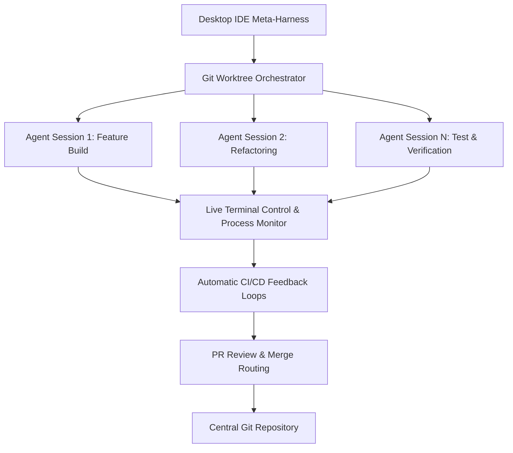
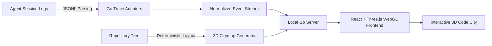
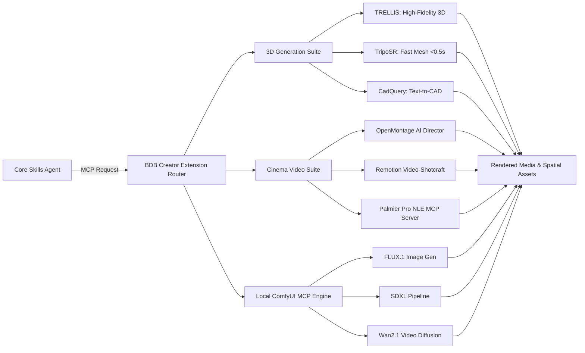

🌐 **Language / Sprache / Idioma**: **English** | [ 🇩🇪 Deutsch ](README.de.md) | [ 🇵🇹 Português ](README.pt.md)

---

```text
██████╗ ██████╗ ██████╗      █████╗  ██████╗ ███████╗███╗   ██╗████████╗     ██████╗ ███████╗
██╔══██╗██╔══██╗██╔══██╗    ██╔══██╗██╔════╝ ██╔════╝████╗  ██║╚══██╔══╝    ██╔═══██╗██╔════╝
██████╔╝██║  ██║██████╔╝    ███████║██║  ███╗█████╗  ██╔██╗ ██║   ██║       ██║   ██║███████╗
██╔══██╗██║  ██║██╔══██╗    ██╔══██║██║   ██║██╔══╝  ██║╚██╗██║   ██║       ██║   ██║╚════██║
██████╔╝██████╔╝██████╔╝    ██║  ██║╚██████╔╝███████╗██║ ╚████║   ██║       ╚██████╔╝███████║
╚═════╝ ╚═════╝ ╚═════╝     ╚═╝  ╚═╝ ╚═════╝ ╚══════╝╚═╝  ╚═══╝   ╚═╝        ╚═════╝ ╚══════╝

                         O P T I M I Z E D   A G E N T   S K I L L S
```

# 🚀 BDB DEV - Optimized Creative & Full-Stack Skills Pack

[](https://github.com/hybridlabor-api/bdb-dev-optimized-agent-skills/actions)
[](https://www.npmjs.com/package/@hybridlabor-api/bdb-dev-optimized-agent-skills)
[](https://github.com/hybridlabor-api/bdb-dev-optimized-agent-skills)
[](LICENSE)
[](https://github.com/hybridlabor-api/bdb-dev-optimized-agent-skills)

> **Supercharging AI coding agents with 153 hyper-curated skills, 22 local MCPs, and deep integrations for the creative technology industry.**

Welcome to the **BDB DEV Skills & MCP Configuration** repository. This project serves as the backbone of our creative and full-stack development ecosystem, supercharging AI agents with highly specialized capabilities tailored for the event and creative technology industry, as well as general-purpose software engineering.

While optimized for **Google Antigravity**, this skills pack and MCP configuration is **100% universal** and works seamlessly with all modern AI agents and developer interfaces, including **ChatGPT Codex / Codex CLI, Claude Desktop, Claude Code, Cursor, Aider, Roo Code, Cline, and Windsurf**.

> 🎙 **Audio Deep Dive: "Give AI Agents Control of Creative Software"**  
> <video src="assets/Give_AI_Agents_Control_of_Creative_Software.mp4" controls></video>

---

### 🪐 Universal Agent Harness
The installer features a fully automated Universal Sync engine. It scans your system for **Claude Desktop, Cursor, Windsurf, Aider, Roo/Cline**, and injects the curated MCP configuration and Godmode rules across all environments simultaneously.

### 🧩 Ecosystem Integrations
This package acts as the bridge to three major upstream capabilities:
- **BDB OS Agent Workspace:** The Orchestration Layer for parallel AI agents. Start multiple isolated agent sessions via Git-Worktrees with live terminal control, automatic CI/CD feedback loops, and PR review routing.
- **BDB Creator Extension:** The heavy-lifting Agentic Media Pipeline. Gives agents local ComfyUI MCP capabilities (FLUX, SDXL), Image-to-3D generation (TripoSR, TRELLIS), and automated video production through OpenMontage and Remotion.
- **BDB Synapse:** 3D Codebase Visualization & Agent Session Replay. Renders your repository as an interactive code city and replays agent sessions as light trails, showing which files were read, edited, and where friction occurred.

## Overview


---

## 🌟 153 Optimized Skills

We started with a massive pool of over 1,400 raw AI skills. After rigorous testing, filtering, and refinement, we've distilled them down to a hyper-curated set of **153 Optimized Skills** (featuring a native OpenWiki documentation engine, the **memB local semantic memory brain**, and **Universal Agent Harness synchronization**).

These skills are precision-engineered to ensure agents waste no time on redundant tasks and instead operate with maximum agency, strict architectural constraints, and robust context awareness.

---

### 🛡️ The 7 Godmodes (Apex Layer)

Instead of letting agents wander through generic instructions, the top-tier of this repository enforces seven **Hyper-Curated Godmodes**. These act as the ultimate gatekeepers for your codebase:

| Godmode | Purpose |
|---------|---------|
| **`godmode-engineering`** | Forces Domain-Driven Design, strict TypeScript checks, Clean Architecture, and systematic 5-step debugging triage. |
| **`godmode-ui-ux`** | The frontend Gold-Standard. Enforces Brand Discovery, Anti-Slop principles, DTCG design tokens, fluid motion physics, and enterprise accessibility. |
| **`godmode-shipping`** | The final gatekeeper for production releases. Enforces Spec-Driven Development, pre-launch checks, feature flags, and safe rollbacks. |
| **`godmode-eventtech`** | Architectural authority for real-time performance, signal flow, protocol routing, and hardware constraints in live show and event technology environments. |
| **`godmode-3d-creation`** | MCP-First master orchestration for 3D generation, mesh reconstruction, and parametric CAD engineering. Interfaces with local 3D engines and MCP tools. |
| **`godmode-media-creation`** | MCP-First master orchestration for all media creation pipelines (Video, Timeline Assembly, Beat Sync, Motion Design). Directly interfaces with local media engines and MCP tools. |
| **`bdbmediastorm`** | The master ideation and brainstorming engine for live shows, show-control, and event technology. Orchestrates multi-agent technical planning focused on hardware constraints, signal routing, protocols (OSC, Art-Net, DMX, MIDI, SMPTE), TouchDesigner, Resolume, and grandMA3. |

### 💻 Beyond Events: Full-Stack Software & Web Agents
While heavily optimized for the creative tech industry, these skills are deeply rooted in core software engineering:
- **Autonomous Web Operations**: Full suite of Firecrawl-powered specialized agents for structured data extraction, automated web interaction, and complex scraping operations.
- **Full-Stack Development**: Spinning up Next.js App Router boilerplates, building scalable Node.js microservices, and crafting interactive frontends.
- **App Development**: Architecting databases with Prisma/Drizzle, designing REST/GraphQL APIs, and building standard web and mobile applications from scratch.
- **Design & Quality Assurance**: Auditing UI/UX patterns (utilizing `ui-ux-pro-max`), enforcing clean code principles, and setting up strict CI/CD pipelines.

---

## 🗂️ The Complete Skill Library

### 🎨 Frontend & UI/UX Design

| Skill | Description |
|-------|-------------|
| `design-spells` | Curated micro-interactions and design details that add "magic" and personality to websites and apps. |
| `design-taste-frontend` | Use when building high-agency frontend interfaces with strict design taste, calibrated color, responsive layout, and motion rules. |
| `frontend-design` | Frontend designer-engineer skill — not a layout generator. |
| `frontend-dev-guidelines` | Senior frontend engineer operating under strict architectural and performance standards. |
| `landing-page-generator` | Generates high-converting Next.js/React landing pages with Tailwind CSS. Uses PAS, AIDA, and BAB frameworks. |
| `senior-frontend` | Frontend development for React, Next.js, TypeScript, and Tailwind CSS. Bundle analysis, accessibility, and code quality. |
| `shadcn` | Manages shadcn/ui components and projects with documentation, usage patterns, and modern design systems. |
| `spline-3d-integration` | Interactive 3D scenes from Spline.design in web projects, including React embedding and runtime control API. |
| `tailwind-patterns` | Tailwind CSS v4 principles. CSS-first configuration, container queries, modern patterns, design token architecture. |
| `ui-component` | Generate UI components following StyleSeed Toss conventions for structure, tokens, accessibility, and ergonomics. |
| `ui-page` | Scaffold mobile-first pages using StyleSeed Toss layout patterns, section rhythm, and shell components. |
| `ui-pattern` | Reusable UI patterns: card sections, grids, lists, forms, and chart wrappers using StyleSeed Toss primitives. |
| `ui-review` | Review UI code for design-system compliance, accessibility, mobile ergonomics, and spacing discipline. |
| `ui-tokens` | List, add, and update StyleSeed design tokens while keeping JSON sources, CSS variables, and dark-mode values in sync. |
| `ui-ux-pro-max` | Comprehensive design guide for web and mobile applications. Color palettes, typography, and UX review. |
| `ux-audit` | Audit screens against Nielsen's heuristics and mobile UX best practices. |
| `ux-feedback` | Add loading, empty, error, and success feedback states with practical mobile-first rules. |
| `ux-flow` | Design user flows and screen structure using progressive disclosure, hub-and-spoke navigation, and information pyramids. |
| `ux-persuasion-engineer` | Behavioral UX specialist applying choice architecture, friction audits, and commitment design. |
| `wcag-audit-patterns` | Auditing web content against WCAG 2.2 guidelines with actionable remediation strategies. |

### ⚛️ React & Next.js

| Skill | Description |
|-------|-------------|
| `nextjs-app-router-patterns` | Comprehensive patterns for Next.js 14+ App Router architecture, Server Components, and modern full-stack React. |
| `nextjs-best-practices` | Next.js App Router principles. Server Components, data fetching, routing patterns. |
| `react-best-practices` | Performance optimization guide for React and Next.js applications by Vercel. |
| `react-component-performance` | Diagnose slow React components and suggest targeted performance fixes. |
| `react-patterns` | Modern React patterns and principles. Hooks, composition, performance, TypeScript best practices. |
| `tanstack-query-expert` | TanStack Query (React Query) — asynchronous state management, mutations, optimistic updates, and SSR integration. |
| `vercel-ai-sdk-expert` | Vercel AI SDK: Core API, UI hooks (useChat, useCompletion), tool calling, and streaming UI components. |
| `vercel-deployment` | Expert knowledge for deploying to Vercel with Next.js. |
| `zustand-store-ts` | Create Zustand stores following established patterns with proper TypeScript types and middleware. |
| `web-artifacts-builder` | Build powerful frontend claude.ai artifacts. |

### 🗄️ Backend, Databases & APIs

| Skill | Description |
|-------|-------------|
| `api-design-principles` | Master REST and GraphQL API design to build intuitive, scalable, and maintainable APIs. |
| `api-patterns` | API design decision-making. REST vs GraphQL vs tRPC selection, response formats, versioning, pagination. |
| `database-design` | Database design principles. Schema design, indexing strategy, ORM selection, serverless databases. |
| `drizzle-orm-expert` | Drizzle ORM for TypeScript — schema design, relational queries, migrations, and serverless database integration. |
| `golang-pro` | Master Go 1.22+ with modern patterns, advanced concurrency, performance optimization, and production-ready microservices. |
| `go-concurrency-patterns` | Go concurrency with goroutines, channels, sync primitives, and context. Worker pools and race condition debugging. |
| `go-playwright` | Robust, stealthy, and efficient browser automation using Playwright Go. |
| `microservices-patterns` | Microservices architecture patterns: service boundaries, inter-service communication, data management, and resilience. |
| `neon-postgres` | Expert patterns for Neon serverless Postgres, branching, connection pooling, and Prisma/Drizzle integration. |
| `openapi-spec-generation` | Generate and maintain OpenAPI 3.1 specifications from code, design-first specs, and validation patterns. |
| `postgres-best-practices` | Postgres performance optimization and best practices from Supabase. |
| `postgresql` | Design PostgreSQL-specific schemas. Data types, indexing, constraints, performance patterns, and advanced features. |
| `prisma-expert` | Prisma ORM — schema design, migrations, query optimization, relations modeling, and database operations. |
| `using-neon` | Neon serverless Postgres: autoscaling, branching, instant restore, and scale-to-zero. |

### 🐍 Python

| Skill | Description |
|-------|-------------|
| `python-pro` | Master Python 3.12+ with modern features, async programming, performance optimization, and production-ready practices. uv, ruff, pydantic, and FastAPI. |
| `python-patterns` | Python development principles. Framework selection, async patterns, type hints, project structure. |
| `python-performance-optimization` | Profile and optimize Python code using cProfile, memory profilers, and performance best practices. |

### 🦕 TypeScript & JavaScript

| Skill | Description |
|-------|-------------|
| `typescript-pro` | Master TypeScript with advanced types, generics, and strict type safety. Complex type systems, decorators, and enterprise-grade patterns. |
| `modern-javascript-patterns` | Mastering modern JavaScript (ES6+) features, functional programming patterns, and best practices. |

### 🧠 AI, LLM & Prompt Engineering

| Skill | Description |
|-------|-------------|
| `ai-product` | Build AI-powered products right — from demo to production. |
| `gemini-api-dev` | Access Google's most advanced AI models via the Gemini API. |
| `gemini-api-integration` | Integrating Google Gemini API: model selection, multimodal inputs, streaming, function calling. |
| `llm-app-patterns` | Production-ready patterns for building LLM applications. |
| `llm-application-dev-ai-assistant` | AI assistant development: intelligent conversational interfaces, chatbots, and AI-powered applications. |
| `llm-prompt-optimizer` | Applies proven prompt engineering techniques to boost output quality, reduce hallucinations, and cut token usage. |
| `llm-structured-output` | Reliable JSON, enums, and typed objects from LLMs using response_format, tool_use, and schema-constrained decoding. |
| `local-llm-expert` | Local LLM inference, model selection, VRAM optimization. Ollama, llama.cpp, vLLM, and LM Studio. GGUF, EXL2 quantization. |
| `prompt-engineer` | Transforms prompts using frameworks (RTF, RISEN, Chain of Thought, RODES, Chain of Density, RACE, RISE, STAR, SOAP, CLEAR, GROW). |
| `prompt-engineering-patterns` | Advanced prompt engineering techniques to maximize LLM performance, reliability, and controllability. |
| `rag-engineer` | Building Retrieval-Augmented Generation systems. Embedding models, vector databases, chunking, and retrieval optimization. |
| `rag-implementation` | RAG implementation: embedding selection, vector database setup, chunking strategies, and retrieval optimization. |
| `vector-database-engineer` | Vector databases, embedding strategies, and semantic search. Pinecone, Weaviate, Qdrant, Milvus, and pgvector. |

### 🤖 Agents & Multi-Agent Systems

| Skill | Description |
|-------|-------------|
| `agent-manager-skill` | Manage multiple local CLI agents via tmux sessions (start/stop/monitor/assign) with cron-friendly scheduling. |
| `agent-memory-mcp` | Hybrid memory system providing persistent, searchable knowledge management for AI agents. |
| `agent-orchestrator` | Meta-skill orchestrating all agents in the ecosystem. Automatic skill scanning, capability matching, and multi-skill workflow coordination. |
| `agent-pipeline` | The 6-stage BDB Software Engineering Pipeline (DEFINE, PLAN, BUILD, VERIFY, REVIEW, SHIP) with slash commands. |
| `agent-tool-builder` | Tool design from schema to error handling — the difference between an agent that works and one that hallucinates. |
| `ai-agent-development` | AI agent development workflow: autonomous agents, multi-agent systems, and agent orchestration with CrewAI, LangGraph. |
| `crewai` | Expert in CrewAI — the leading role-based multi-agent framework. |
| `subagent-driven-development` | Execute implementation plans with independent tasks in the current session. |

### 🕷️ Web Scraping & Automation

| Skill | Description |
|-------|-------------|
| `apify-lead-generation` | Scrape leads from multiple platforms using Apify Actors. |
| `apify-ultimate-scraper` | AI-driven data extraction from 55+ Actors across all major platforms. |
| `browser-automation` | Browser automation for web testing, scraping, and AI agent interactions. Selectors, waiting strategies, anti-detection. |
| `web-scraper` | Intelligent multi-strategy web scraping. Structured data extraction from tables, lists, prices. Pagination, monitoring, CSV/JSON export. |

### 🔥 Firecrawl Workspace Agents

| Skill | Description |
|-------|-------------|
| `firecrawl` | Search, scrape, and interact with the web via the Firecrawl CLI. Real-time web search with full page content. |
| `firecrawl-agent` | AI-powered autonomous data extraction that navigates complex sites and returns structured JSON. |
| `firecrawl-build` | Integrate Firecrawl into product code for web scraping, crawling, searching, and interaction. |
| `firecrawl-build-interact` | Integrate Firecrawl `/interact` for dynamic pages and browser actions after scraping. |
| `firecrawl-build-onboarding` | Get Firecrawl credentials and SDK setup into a project. |
| `firecrawl-build-scrape` | Integrate Firecrawl `/scrape` for single-page extraction in product code. |
| `firecrawl-build-search` | Integrate Firecrawl `/search` into product code and agent workflows. |
| `firecrawl-crawl` | Bulk extract content from an entire website or site section. Depth limits, path filtering, concurrent extraction. |
| `firecrawl-download` | Download an entire website as local files — markdown, screenshots, or multiple formats per page. |
| `firecrawl-interact` | Control a live browser session: click buttons, fill forms, navigate flows, extract data. |
| `firecrawl-map` | Discover and list all URLs on a website with optional search filtering. |
| `firecrawl-scrape` | Extract clean markdown from any URL, including JavaScript-rendered SPAs. |
| `firecrawl-search` | Web search with full page content extraction. Real search results with optional full-page markdown. |

### 📈 SEO & Marketing

| Skill | Description |
|-------|-------------|
| `copywriting` | Rigorous, conversion-focused marketing copy for landing pages and emails. |
| `geo-fundamentals` | Generative Engine Optimization for AI search engines (ChatGPT, Claude, Perplexity). |
| `programmatic-seo` | Design and evaluate programmatic SEO strategies at scale using templates and structured data. |
| `schema-markup` | Design, validate, and optimize schema.org structured data for SEO impact. |
| `seo` | Broad SEO audit: technical SEO, on-page SEO, schema, sitemaps, content quality, AI search readiness, and GEO. |
| `seo-audit` | Diagnose and audit SEO issues affecting crawlability, indexation, rankings, and organic performance. |
| `seo-technical` | Audit technical SEO: crawlability, indexability, security, URLs, mobile, Core Web Vitals, structured data, JS rendering. |

### 🚀 DevOps, Infrastructure & CLI

| Skill | Description |
|-------|-------------|
| `bash-linux` | Bash/Linux terminal patterns. Critical commands, piping, error handling, scripting. |
| `cloudflare-workers-expert` | Cloudflare Workers and Edge Computing. Wrangler, KV, D1, Durable Objects, and R2 storage. |
| `docker-expert` | Advanced Docker containerization: optimization, security hardening, multi-stage builds, orchestration, and production deployment. |
| `github` | Use the `gh` CLI for issues, pull requests, Actions runs, and GitHub API queries. |
| `github-actions-templates` | Production-ready GitHub Actions workflow patterns for testing, building, and deploying. |
| `github-repo` | Standards and workflows for writing, formatting, sanitizing, and publishing high-quality GitHub repositories. |
| `github-workflow-automation` | Patterns for automating GitHub workflows with AI assistance. |
| `monorepo-management` | Efficient, scalable monorepos enabling code sharing, consistent tooling, and atomic changes. |
| `os-scripting` | OS and shell scripting troubleshooting for Linux, macOS, and Windows. |
| `posix-shell-pro` | Strict POSIX sh scripting for maximum portability across Unix-like systems. |
| `tmux` | tmux session, window, and pane management for terminal multiplexing and persistent remote workflows. |
| `turborepo-caching` | Configure Turborepo for efficient monorepo builds with local and remote caching. |

### 🧊 3D, Motion & Video

| Skill | Description |
|-------|-------------|
| `remotion` | Generate walkthrough videos from Stitch projects using Remotion with smooth transitions, zooming, and text overlays. |
| `threejs-skills` | Create 3D scenes, interactive experiences, and visual effects using Three.js and WebGL. |

### 📝 Documentation, Planning & Quality

| Skill | Description |
|-------|-------------|
| `architect-review` | Master software architect specializing in modern architecture review. |
| `clean-code` | Principles of "Clean Code" by Robert C. Martin. Transform "code that works" into "code that is clean." |
| `concise-planning` | Generate clear, actionable, and atomic checklists for coding tasks. |
| `debugger` | Debugging specialist for errors, test failures, and unexpected behavior. |
| `deep-research` | Autonomous research tasks that plan, search, read, and synthesize comprehensive reports. |
| `documentation` | Documentation generation: API docs, architecture docs, README files, code comments, and technical writing. |
| `executing-plans` | Execute written implementation plans in a separate session with review checkpoints. |
| `git-advanced-workflows` | Advanced Git techniques: clean history, effective collaboration, and recovery. |
| `git-pr-review` | Generate concise and structured PR descriptions from commit history. |
| `linear-claude-skill` | Manage Linear issues, projects, and teams. |
| `planning-with-files` | Use persistent markdown files as "working memory on disk." |
| `product-manager-toolkit` | Essential tools and frameworks for modern product management, from discovery to delivery. |
| `readme` | Expert technical writer creating absurdly thorough project documentation. |
| `simplify-code` | Review a diff for clarity and safe simplifications, then optionally apply low-risk fixes. |
| `software-architecture` | Quality-focused software architecture for code design, analysis, and development. |
| `systematic-debugging` | Use before proposing fixes when encountering any bug, test failure, or unexpected behavior. |
| `tdd-workflow` | Test-Driven Development workflow principles. RED-GREEN-REFACTOR cycle. |
| `test-driven-development` | Use when implementing any feature or bugfix, before writing implementation code. |
| `writing-plans` | Use when you have a spec or requirements for a multi-step task, before touching code. |

### 📦 Utilities & Integrations

| Skill | Description |
|-------|-------------|
| `bdb-updater` | Proactively check for and install updates to the BDB Antigravity Skills package via NPM. |
| `google-sheets-automation` | Lightweight Google Sheets integration with standalone OAuth authentication. Full read/write access. |
| `MCP_Manage` | Manages the BDB specialized MCP servers including Unreal Engine, Rhino 7/8, DaVinci Resolve, grandMA3, Resolume, GitHub, Chrome DevTools, and TouchDesigner. |
| `n8n-code-javascript` | Write JavaScript code in n8n Code nodes. `$input`/`$json`/`$node` syntax, HTTP requests, DateTime handling. |
| `n8n-code-python` | Write Python code in n8n Code nodes. `_input`/`_json`/`_node` syntax and standard library. |
| `n8n-expression-syntax` | Validate n8n expression syntax and fix common errors. `{{}}` syntax, `$json`/`$node` variables. |
| `n8n-mcp-tools-expert` | Expert guide for using n8n-mcp MCP tools effectively. Tool selection, parameter formats, common patterns. |
| `n8n-workflow-patterns` | Proven architectural patterns for building n8n workflows. |
| `notion-automation` | Automate Notion tasks via Rube MCP (Composio): pages, databases, blocks, comments, users. |
| `obsidian-markdown` | Obsidian Flavored Markdown with wikilinks, embeds, callouts, properties, and Obsidian-specific syntax. |
| `playwright-skill` | Browser automation and testing with Playwright. Path-aware installation across plugin systems. |
| `senior-fullstack` | Complete toolkit for senior fullstack development with modern tools and best practices. |
| `slack-automation` | Automate Slack workspace operations: messaging, search, channel management, and reaction workflows. |
| `token-saver-config` | Context window output compression engine for CLI commands (60-99% token reduction). |
| `webapp-testing` | Test local web applications with native Python Playwright scripts. |
| `web-performance-optimization` | Optimize website performance: loading speed, Core Web Vitals, bundle size, caching, and runtime performance. |

### 🌀 BDB Ecosystem & Methodologies

| Skill | Description |
|-------|-------------|
| `bdbrainstorm` | Combines multi-agent brainstorming, the `/grill-me` slash command, subagent-driven-development, and ui-ux-pro-max for comprehensive ideation. |
| `memb-skill` | BDB local-first long-term memory engine (memB). Query, remember, and adapt preferences, code architectures, and developer patterns across tasks. |
| `memb-ingest` | Deep scan and ingest project files (.md, .json, AGENTS.md, .openwiki) and past conversation logs into the local memB vector memory engine. |
| `openwiki-skill` | Direct Gemini-native integration of OpenWiki for autonomous, high-agency documentation management and release notes maintenance. |

---

## 🔄 BDB Software Engineering Pipeline & Slash Commands

```text
 IDEATE & MEDIA STORM     DEFINE & SCAFFOLD      PLAN & SPEC      BUILD & MCPs       VERIFY        SHIP
 ┌──────────────────┐    ┌─────────────────┐    ┌───────────┐    ┌────────────┐   ┌──────────┐   ┌──────────┐
 │ Grill Me & Media │ ──▶│  Folder Select  │ ──▶│ Spec &    │ ──▶│ Subagents  │──▶│ QA Gate  │──▶│ OpenWiki │
 │   Brainstorming  │    │ OpenWiki & Repo │    │   Plan    │    │ & MCP Dev  │   │ Review   │   │  & Push  │
 └──────────────────┘    └─────────────────┘    └───────────┘    └────────────┘   └──────────┘   └──────────┘
/grill-me /bdbmediastorm  /openwiki /github-repo    /plan          /subagents       /review        /ship
 └──────────────────────────────────────────────────────────────────────────────────────────────────────────┘
                                  🚀 Autonomous Execution: /startcycle
```

AI agents follow this structured lifecycle, deeply integrated with the **BDBrainstorm** and **BDBMediaStorm** philosophy:

- **🚀 Autonomous Pipeline (`/startcycle`)**: Prompt-less execution macro that runs the 5-agent team (`Planner_Orchestrator` ➔ `Godmode_UI_UX`, `Godmode_Engineering`, `Godmode_Media_EventTech` ➔ `Godmode_Shipping` ➔ `.openwiki` + `memB`) with deterministic file hand-offs in `production_artifacts/`.
- **1. IDEATE & MEDIA STORM (`/grill-me`, `/bdbrainstorm`, `/bdbmediastorm`)**: Actively challenge ideas or conduct multi-agent media/event-tech brainstorming. Spawns specialized subagents (CI/Design Expert, Real Time Architect, MCP Implementer) to validate hardware, 3D scenography (Rhino, Blender, Unreal), protocols (OSC, Art-Net), and MCP compatibility.
- **2. DEFINE & SCAFFOLD (`openwiki-skill`, `github-repo`)**: Confirm target workspace directory with the user, then autonomously initialize project documentation, `AGENTS.md`, `.openwiki/` structures, and GitHub repo standards.
- **3. PLAN (`/plan`)**: Create technical design specs, PRD, and file-by-file implementation plans, strictly adhering to `godmode-ui-ux` standards.
- **4. BUILD (`/subagents`)**: Subagent-driven development. The master orchestrator delegates specific component creation, node patching, and refactoring tasks to independent subagents.
- **5. VERIFY & REVIEW (`/review`)**: Perform QA gate reviews, secret scans, unit test suites, and strict UI/UX or signal-flow audits.
- **6. SHIP (`/ship`)**: Commit, push private repositories, update OpenWiki docs autonomously, ingest into memB, and deploy live.

---

## 🧠 BDBrainstorm: The Ultimate Ideation Engine

Included in this optimized arsenal is our proprietary **BDBrainstorm** skill.

BDBrainstorm combines multi-agent brainstorming, the `/grill-me` slash command, subagent-driven development, and extreme UI/UX design workflows to force a comprehensive, multi-agent ideation process. It stress-tests designs, architectures the systems behind them, and outputs actionable, high-fidelity implementation plans.

---

## 🔌 22 Custom Local MCP Integrations


Rather than relying on skeletal python mocks or broken remote APIs, this repository bundles **22 custom, local MCP wrappers** (in the `mcps/` directory). These are built/warmed automatically and allow your AI assistant to read, write, and execute commands within the industry's leading creative software.

<details>
<summary><strong>🎨 Adobe Creative Cloud (Illustrator, Photoshop, After Effects, Premiere Pro)</strong></summary>

We provide a dual-engine architecture optimized for macOS and Windows environments:
- **Direct OS-Native Bridge (`bdb_adobe_mcp`)**: Runs zero-install scripting.
  - **macOS:** Targets application bundle IDs directly via AppleScript `do javascript` / `DoScript` command streams.
  - **Windows:** Automatically queries and instantiates local COM objects via PowerShell wrapper scripts and executes transient `.jsx` ExtendScript code.
- **Cross-Platform UXP WebSocket Bridge (`bdb_adobe_uxp_mcp`)**: A three-tier WebSocket proxy (Node.js server on port 8080 + native UXP developer plugins) for deep DOM manipulation and persistent WebSocket sessions inside Photoshop and Premiere Pro, running identically on Windows and macOS.
</details>

<details>
<summary><strong>🎬 DaVinci Resolve (Triple Coverage)</strong></summary>

- **Primary: `bdb_davinci_mcp`**: Works on both the **Free and Studio** versions using a workspace script menu loop. Exposes 162 tools (Timeline, clips, markers, grades, Fusion) and includes local CPU-based AI models (Meta Demucs v4 for voice isolation, faster-whisper for auto-subtitles, and rembg for background removal).
- **Studio: `bdb_davinci_mcp_studio`**: The official Node.js server (wrapping samuelgursky) for advanced direct timeline and project management in Resolve Studio.
- **Fallback: `bdb_davinci_mcp_fallback`**: Hoyt-harness professional python server for Studio scripting.
</details>

<details>
<summary><strong>📐 Rhino 3D & Grasshopper (Twin-Engine)</strong></summary>

- **Primary: `bdb_rhino_mcp`**: McNeel's official connector (managed via Yak router) for native reading/writing of Rhino geometric layouts.
- **Fallback: `bdb_rhino_mcp_fallback`**: The GOLEM 3D server with 105 tools to dynamically manipulate Rhino 8 assets, execute scripts, and solve Grasshopper definitions.
</details>

<details>
<summary><strong>🏗️ Additional Specialized Integrations (Unreal, TouchDesigner, Vectorworks, etc.)</strong></summary>

### 🏗️ Vectorworks
- **Primary: `bdb_vectorworks_mcp`**: Semantic RAG-based search index over VectorScript and Vectorworks API documentation (port 8765) for automated CAD drafting.

### 🎮 Unreal Engine
- **Primary: `bdb_unreal_mcp`**: Connects via the Unreal Engine 5 Web Remote Control API (port 30010) and the `gimmeDG` toolset. Allows the agent to query, spawn actors, edit materials, write Blueprints, and automate level/sequencer manipulation.

### 🧊 Blender (Twin-Engine)
- **Primary: `bdb_blender_mcp`**: BlenderMCP socket integration for scene layout, mesh generation, and viewport controls.
- **Fallback: `bdb_blender_mcp_fallback`**: djeada's python server for managing Blender TCP connections and raw python scripting.

### 🎛️ TouchDesigner (Twin-Engine)
- **Primary: `bdb_touchdesigner_mcp`**: MindDesigner-Bridge (`tdmcp`) on port 9980 to read and write networks via custom `.tox` structures.
- **Fallback: `bdb_touchdesigner_mcp_fallback`**: fallback TCP-based node query and inspector.

### 💡 grandMA3 & Resolume
- **grandMA3**: `bdb_ma3_mcp` sends OSC/UDP command streams directly to your grandMA3 console (port 8000) to automate cues, macros, and patch fixtures.
- **Resolume**: `bdb_resolume_mcp` wraps Arena's REST API (port 8080) to sequence layers, query statuses, and trigger clips.

### 🖥️ OS Control (Dual-Engine)
- **macOS/Linux: `zavora_computer_use`**: Bundled with precompiled native Rust NAPI binary objects (macOS arm64/x64, Linux) to control mouse, keyboard, windows, and apps without runtime compile errors.
- **Windows: `bdb_windows_computer_use`**: Native python-based Win32 / COM / UIAutomation controller with local OCR (Tesseract) support for advanced Windows GUI automation.

### 🧠 Local Semantic Brain (memB)
- **`memb_mcp`**: Exposes standard long-term memory tools (`add_memory`, `search_memory`, `delete_memory`, `list_memories`) using a completely local, offline-first vector engine (powered by a bundled 30MB ONNX model and SQLite).
</details>

---

## 📖 MCP System Skills

This repository contains deep-system configurations and documentation guidelines mapped automatically. If an AI agent imports this pack, it will immediately read these markdown files to learn the tool signatures, expected arguments, ExtendScript hooks, and common troubleshooting steps for each application.

<details>
<summary><strong>View System Skills List</strong></summary>

- [`bdb-unreal-mcp.md`](skills/global_config/bdb-unreal-mcp.md)
- [`bdb-rhino-mcp.md`](skills/global_config/bdb-rhino-mcp.md)
- [`bdb-davinci-mcp.md`](skills/global_config/bdb-davinci-mcp.md)
- [`bdb-blender-mcp.md`](skills/global_config/bdb-blender-mcp.md)
- [`bdb-after-effects-mcp.md`](skills/global_config/bdb-after-effects-mcp.md)
- [`bdb-vectorworks-mcp.md`](skills/global_config/bdb-vectorworks-mcp.md)
- [`bdb-touchdesigner-mcp.md`](skills/global_config/bdb-touchdesigner-mcp.md)
- [`bdb-computer-use-mcp.md`](skills/global_config/bdb-computer-use-mcp.md)
- [`bdb-grandma3-mcp.md`](skills/global_config/bdb-grandma3-mcp.md)
- [`bdb-resolume-mcp.md`](skills/global_config/bdb-resolume-mcp.md)
- [`bdb-adobe-suite-mcp.md`](skills/global_config/bdb-adobe-suite-mcp.md)
- [`bdb-memb-mcp.md`](skills/global_config/bdb-memb-mcp.md)
- [`openwiki-skill`](skills/global_config/openwiki-skill/SKILL.md): Direct Gemini-native integration of OpenWiki for autonomous, high-agency documentation management and release notes maintenance.
- [`memb-skill`](skills/global_config/memb-skill/SKILL.md): BDB local-first long-term memory engine (memB). Query, remember, and adapt preferences, code architectures, and developer patterns across tasks.
</details>

---

## 🌐 OpenWiki & RepoGraph Code Health Engine

The **OpenWiki Engine** autonomously maintains living codebase documentation, architecture specs, ADRs, release notes, and real-time code health analytics across all your active projects.

### 📚 Documentation & Dashboard
- **Entrypoint & Setup:** [.openwiki/quickstart.md](.openwiki/quickstart.md)
- **Architecture & Ecosystem:** [.openwiki/architecture.md](.openwiki/architecture.md)
- **Design Decisions (ADRs):** [.openwiki/decisions.md](.openwiki/decisions.md)
- **Changelog & History:** [.openwiki/release_notes.md](.openwiki/release_notes.md)
- **Code Health Report:** [.openwiki/code_health.md](.openwiki/code_health.md)
- **Interactive Live Dashboard:** [.openwiki/code_health_dashboard.html](.openwiki/code_health_dashboard.html)

<details>
<summary><strong>🧠 Multi-Provider LLM & Zero-Token RepoGraph Architecture</strong></summary>

1. **Multi-Provider LLM Agility:** Decoupled from single-vendor lock-in. Configure any LLM backend via environment variables:
   - **Google GenAI:** `gemma-4-26b-a4b-it` (default via `google-genai` SDK, with automatic model discovery fallback)
   - **Groq:** `llama-3.3-70b-versatile` (ultra-low latency)
   - **Grok / xAI:** `grok-2-latest`
   - **Nvidia NIM:** `meta/llama-3.3-70b-instruct`
   - **OpenRouter:** `anthropic/claude-3.5-sonnet` (200+ models)
   - **OpenAI:** `gpt-4o-mini` / `gpt-4o`
   - **Offline / Local:** Ollama (`llama3`), LM Studio, or any OpenAI-compatible endpoint.
2. **RepoGraph Zero-Token Git Analytics:** Analyzes 90-day hotspot velocity, single-author bus factor risk, and maintainability index purely through deterministic local Git analysis—costing **0 LLM tokens**.
3. **Repowise-Grade Live HTML Dashboard:** `.openwiki/code_health_dashboard.html` provides 6 visual SVG panels (Galaxy Cluster Map, Risk Donut, Bus Factor Matrix, Commit Velocity Churn, Hotspot Leaderboard, Architecture Health Radar) with **60-second live auto-refresh** and integrated memB ADR telemetry.
</details>

<details>
<summary><strong>⚙️ Setting Up the Background Daemon</strong></summary>

To ensure your project documentation and code health dashboards never go out of date, configure the background daemon:

#### On macOS (LaunchAgent)
```bash
bash ~/.gemini/config/skills/openwiki-skill/scripts/install_daemon.sh
```

#### On Windows (Task Scheduler)
```powershell
powershell -ExecutionPolicy Bypass -File "$env:USERPROFILE\.gemini\config\skills\openwiki-skill\scripts\install_daemon.ps1"
```

#### For All Platforms: Register Projects & Monitor
**Register Projects:** Add workspace paths to your config file at `~/.openwiki/projects.json`:
```json
{
  "projects": [
    "~/bdb-dev/bdb-dev-optimized-agent-skills",
    "~/Projects/your-active-project"
  ],
  "interval_seconds": 3600
}
```

**Monitor Execution:** Tail the active logs to inspect background documentation rebuild status:
```bash
tail -f ~/.openwiki/daemon.log
```
</details>

---

## 🖥️ BDB OS Agent Workspace: Parallel Multi-Agent Orchestration

[](https://github.com/hybridlabor-api/bdb-os-agent-workspace)
[](https://github.com/hybridlabor-api/bdb-os-agent-workspace)
[](https://github.com/hybridlabor-api/bdb-os-agent-workspace)
[](LICENSE)

**BDB OS Agent Workspace** is the Desktop Meta-Harness and Orchestration Layer designed for parallel AI agents. It enables developers to spawn, manage, and coordinate multiple isolated agent sessions concurrently across independent Git Worktrees with real-time terminal feedback loops and automated PR review routing.



<details>
<summary><strong>⚙️ Architecture & Worktree Orchestration</strong></summary>

- **Git Worktree Isolation:** Instantiates dedicated, clean working trees for each subagent session, preventing file state corruption or lock file collisions during concurrent edits.
- **Desktop Meta-Harness:** Coordinates multi-workspace setups, environment variables, and local server ports across concurrent developer environments.
- **Parallel Agent Execution:** Spawns autonomous agents working simultaneously on separate modules, features, or bug fixes without interfering with the primary workspace branch.
</details>

<details>
<summary><strong>🔬 Technical Specifications & Automated Routing</strong></summary>

- **Live Terminal Control:** Captures stdout/stderr streams from subagents with active process monitoring, session lifecycle control, and real-time status reporting.
- **Automatic CI/CD Feedback Loops:** Monitors test outputs and build tasks, routing error traces directly back into the executing subagent's context for instant repair.
- **PR Review Routing:** Packages completed features, runs automated security and code health checks, and routes generated Pull Requests for user review or automated merging.
</details>

<details>
<summary><strong>🔌 Supported Harnesses & Direct Repository Link</strong></summary>

- **Supported Agent Harnesses:**
  - **Google Antigravity / AGY CLI**
  - **Claude Desktop & Claude Code**
  - **Cursor & Windsurf**
  - **Roo Code & Cline**
  - **ChatGPT Codex / Codex CLI**
  - **Aider & VS Code**
- **Direct Repository:** Access the workspace orchestrator at [github.com/hybridlabor-api/bdb-os-agent-workspace](https://github.com/hybridlabor-api/bdb-os-agent-workspace).

```bash
git clone https://github.com/hybridlabor-api/bdb-os-agent-workspace.git
```
</details>

---

## 🧿 BDB Synapse: 3D Codebase Visualization & Agent Session Replay

[](https://github.com/hybridlabor-api/bdb-synapse)
[](https://github.com/hybridlabor-api/bdb-synapse)
[](https://github.com/hybridlabor-api/bdb-synapse)
[](https://github.com/hybridlabor-api/bdb-synapse/blob/main/LICENSE)

**BDB Synapse** renders your repository as an interactive **3D code city** and replays coding-agent sessions as light trails moving through it — showing which files were read, edited, and where friction occurred. One Go binary, fully local, zero telemetry.

Inspired by and forked from [cosmtrek/mindwalk](https://github.com/cosmtrek/mindwalk) (MIT License).



### Supported Agents

| Agent | Log Source | Status |
|-------|-----------|--------|
| **Claude Code** | `~/.claude/projects/` | ✅ Native |
| **Codex CLI** | `~/.codex/sessions/` | ✅ Native |
| **Pi Agent** | `~/.pi/agent/sessions/` | ✅ Native |
| **Antigravity (agy)** | `~/.gemini/antigravity-cli/brain/` | ✅ BDB Extension |

### Key Features
- **Tree & Terrain Views:** Repository as a radial tree or treemap — glow ∝ how deeply a file was touched.
- **Touch States:** Seen (moss green), Read (moonlight blue), Edited (warm amber), Unvisited (dark).
- **Playback Deck:** Scrub or play the session over a bucketed histogram. Observation stays cool, mutation glows warm.
- **Agent Lenses:** When a session launched subagents, pick a lens to replay any subagent's trace on the same map.
- **Session Evaluation:** Ask a local agent CLI to judge the session's trajectory against criteria drafted from your own request.

```bash
synapse                              # scan all agent dirs, open browser
synapse open <session.jsonl>         # replay one specific session
synapse map <repo>                   # render a repository map, no session needed
```

---

## 🎨 BDB Creator Extension: Heavy-Lifting Media & 3D Compute Pipeline

[](https://github.com/hybridlabor-api/bdb-dev-creator-extension)
[](https://github.com/hybridlabor-api/bdb-dev-creator-extension)
[](https://github.com/hybridlabor-api/bdb-dev-creator-extension)
[](https://github.com/hybridlabor-api/bdb-dev-creator-extension)
[](LICENSE)

**BDB Creator Extension** (`bdb-dev-creator-extension`) is the heavy-lifting media compute pipeline designed to keep the core agent skills pack fast, lightweight, and responsive (<25MB). It encapsulates CUDA/ML neural networks, 3D mesh synthesis, parametric CAD generation, automated video editing, and local ComfyUI rendering engines.



<details>
<summary><strong>🔷 3D Generation Suite (`engines/3d/`)</strong></summary>

- **Microsoft TRELLIS:** High-fidelity image-to-3D asset generation producing textured 3D meshes and NeRF/Gaussian Splat representations.
- **Stability AI TripoSR:** Ultra-fast sub-second (<0.5s) single-image to 3D mesh generation for rapid spatial prototyping.
- **CadQuery Parametric Text-to-CAD:** Generates precise engineering models and architectural geometry in STEP, STL, and URDF formats.
</details>

<details>
<summary><strong>🎬 Cinema Video Suite (`engines/video/`)</strong></summary>

- **OpenMontage AI Orchestrator:** Automated video storytelling, script-to-timeline assembly, and shot sequencing.
- **Remotion Video-Shotcraft:** 100+ cinema-grade programmatic video components and motion graphics templates built with React.
- **Palmier Pro NLE MCP Server:** Real-time HTTP MCP bridge (`http://127.0.0.1:19789/mcp`) exposing macOS native non-linear video editing capabilities.
</details>

<details>
<summary><strong>🎨 Local ComfyUI MCP Engine & Direct Repository Link (`mcps/comfyui-mcp/`)</strong></summary>

- **Model Context Protocol Integration:** Exposes local ComfyUI workflows directly as executable tools for AI agents over MCP.
- **Supported Generative Models:**
  - **FLUX.1:** High-resolution image synthesis and prompt adherence.
  - **SDXL:** Latent diffusion workflow control with custom LoRAs and ControlNets.
  - **Wan2.1:** Generative video diffusion models for high-frame-rate clip creation.
- **Direct Repository:** Access the extension suite at [github.com/hybridlabor-api/bdb-dev-creator-extension](https://github.com/hybridlabor-api/bdb-dev-creator-extension).

```bash
git clone https://github.com/hybridlabor-api/bdb-dev-creator-extension.git
```
</details>

<details>
<summary><strong>🌍 BDB OS Remote Gateway & Thin-Client (`mcps/bdb-os-remote/`)</strong></summary>

- **Zero-Trust SSE Transport:** Run Claude Desktop on your laptop while executing tools natively on your stationary Workstation over a secure Tailscale tunnel.
- **Asymmetric Topology:** Installs `heimdall-token-saver` locally on your laptop to compress tokens *before* calling the LLM, while `memB`, `synapse`, and file operations are routed to the Workstation.
- **Offline Clone Tool:** One-click project archives streamed seamlessly over Tailscale without heavy `node_modules`.
- **Direct Repository:** Access the gateway at [github.com/hybridlabor-api/bdb-os-remote](https://github.com/hybridlabor-api/bdb-os-remote) or install via NPX:

```bash
npx @hybridlabor-api/bdb-os-remote installer
```
</details>

---

## 🧠 memB: Custom Semantic Brain

BDB OS introduces a fully integrated local, offline-first semantic memory brain based on **memB**. It provides zero-compute context for SLMs and an AI-first flat-file vault architecture.

<details>
<summary><strong>⚙️ How the Ecosystem Works (Skills, Vaults, & Obsidian)</strong></summary>

### 1. Ingestion via the `/memb-ingest` Skill
The ecosystem includes a deeply integrated skill (`/memb-ingest`). When an agent runs this, the `memb_ingest.py` script recursively scans your project (reading `.openwiki`, `AGENTS.md`, transcripts, and architecture files). 
* **Offline Vector Embeddings:** It bundles a pre-quantized 30MB `all-MiniLM-L6-v2` ONNX model to chunk and store these learnings natively in a fast SQLite vector store (`~/.MemBDB/memb.db`), all without hitting external APIs.

### 2. Autonomous AI-First Vault Generation
Once ingestion completes, memB natively generates a **physical Markdown Vault** (`~/.MemBDB/memB_Vault`) structured around a strict "God Mode" radial topology:
* **Zero-Compute Context:** A universal `AGENTS.md` and a master `God_Mode.md` are written to the root. Small 30MB local inference models can instantly orient themselves macroscopically by reading these physical files without spending context tokens on complex database calls.
* **Micro-Targeted RAG:** For precise execution, the small LLMs query the vector DB to retrieve just the exact 3-5 sub-files needed.

### 3. The Obsidian Visualization Plugin
memB includes a native **Obsidian Plugin** (`obsidian-memb-plugin`) that acts as a visual UI over your physical vault.
* **Top-Down Radial Tree:** It reads the generated `memB_Vault` and maps it visually using Obsidian's graph view. 
* By strictly using directional parent-to-child links (e.g., God Mode -> Projects -> Category -> Neuron), the Obsidian graph blossoms outward like a flower, completely preventing the "black hole" context clustering seen in unstructured graph databases.

### 4. Data Sovereignty & Security
* **Zero Telemetry:** Absolute data sovereignty with no remote tracking.
* **Secret Filtration:** Blocks passwords, raw API keys, and connection strings before injection.
</details>

---

## ⚡ Heimdall Token Saver: CLI Context Compression


**Heimdall Token Saver** is an ultra-fast context compression engine designed to drastically reduce context window usage for CLI tool execution outputs in AI agent workflows.

<details>
<summary><strong>⚙️ Purpose & Performance</strong></summary>

- **Automatic CLI Output Context Compression:** Reduces token overhead by **60–99%** on high-volume CLI tool outputs without impacting agent understanding.
- **Zero Information Loss Guarantee:** Preserves all error messages, failed assertions, stack traces, exit codes, and actionable debugging context while stripping redundant whitespace, progress spinners, and repetitive logs.
- **Automatic Secret Redaction:** Automatically detects and redacts passwords, tokens, API keys, and sensitive environment variables prior to inserting command output into agent context windows.
</details>

<details>
<summary><strong>🔬 Technical Specifications & Processors</strong></summary>

- **36 Specialized Processors:** Includes tailored compression rules for:
  - **Version Control & Dev Tools:** `git` (status, diff, log, branch)
  - **Testing Frameworks:** `pytest`, `jest`, `cargo test`, `vitest`, `go test`
  - **Containers & Infrastructure:** `docker`, `kubectl`, `terraform`
  - **Package Managers & Build Systems:** `npm`, `yarn`, `pnpm`, `pip`, `cargo`, `go` package listings and build outputs
- **Preservation Rules:** Guarantees line numbers, error traces, and exact failure sites remain 100% intact for immediate root-cause diagnosis.
</details>

<details>
<summary><strong>🔌 Agent Integration & Hooks</strong></summary>

- **Automated Hook Installation:** Configured and installed seamlessly via `installer.js`.
- **Supported Harnesses:**
  - **Claude Code:** Integrated via `PreToolUse` hook.
  - **Google Antigravity CLI:** Integrated via `AfterTool` hook.

### 📊 CLI Diagnostics & Tooling
You can run diagnostic and benchmarking commands directly in your terminal:
- **Check Version:** `token-saver version`
- **View Savings & Usage Statistics:** `token-saver stats`
- **Benchmark Command Savings:** `token-saver benchmark '<command>'`
</details>

---

## 🛠️ Installation

### 🆚 Which Version Should I Use?

- **Agent Skills Version (`bdb-dev-optimized-agent-skills`)**: Includes all optimized skills, interactive MCP selection UI, and **active background daemons**. It automatically installs and orchestrates the `memB` local semantic memory engine and the `OpenWiki` self-documenting git-hooks. Best for fully autonomous, long-term project management.
- **Legacy Antigravity Version (`bdb-antigravity-skills@legacy`)**: The original antigravity pack.

The installer is built using an interactive Node-based menu. It allows you to:
1. **Backup & Overwrite**: Safely backups existing configuration files and overrides them.
2. **Merge**: Merges the new skills, configs, and custom local MCP paths with your existing ones.

### Option 1: Ask Your AI Agent (Easiest)
Simply tell your assistant:
> "Please run `npx -y @hybridlabor-api/bdb-dev-optimized-agent-skills@latest` to install the skills pack and configure the local MCP servers."

### Option 2: Command Line (Global via NPX - Recommended)
Run the script globally in your terminal. We recommend always appending `@latest` to fetch the newest version:

```bash
npx -y @hybridlabor-api/bdb-dev-optimized-agent-skills@latest
```
*(This command works on Mac/Linux terminals as well as Windows PowerShell!)*

### Option 3: Using Homebrew (macOS)
If you are on a Mac and prefer Homebrew, you can tap and install the package:
```bash
brew tap hybridlabor-api/bdb-skills
brew install bdb-skills
bdb-skills
```

### Option 4: Manual Shell Script (Git Clone)
Clone the repository and run the installer script:
```bash
git clone https://github.com/hybridlabor-api/bdb-dev-optimized-agent-skills.git
cd bdb-dev-optimized-agent-skills
chmod +x installer.sh
./installer.sh
```

**The installer script will automatically:**
1. Back up your existing global and workspace skills safely.
2. Deploy the new curated global config skills.
3. Install the workspace-specific agent skills.
4. Copy the customized `GEMINI.md` to `~/.gemini/GEMINI.md`.
5. Pre-warm Python dependencies via `uv run` to prevent AI agent timeouts on first run.

---
*Elevate your agency. Dominate the workflow.*
